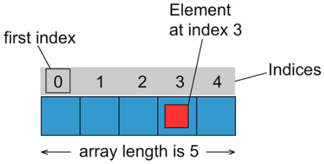

## Array

An array is a variable that can hold a row of values. Also called collection. In other wordt it is a data structure that allows you to store sequence of values, that are all of the same type.

Array always starts from the index 0.

### Example #1

Declaring an array initially is similar to declaring a regular variable.

    int myVariableInt = 50;

Define an array you put square brackets `[]` after int. That tells the Java compiler that we're not dealing with a regular variable, but with an array. And delete "= 50", which is illegal for an array.

    int[] myVariableArray;

Put in the number of elements we want to assign in the array.

    myVariableArray = new int[10];

Compile the two lines together.

    int[] myVariableArray2 = new int[10];

Accessing the array elements. This is saving the value 50 into element 6, because arrays in Java always start the count at position 0.

    myVariableArray2[5] = 50;

Retrieve a value from a particular element.

    System.out.println(myVariableArray2[5]); // gives 50

If you want to initialize every value in the array, you can do `myVariableArray2[0] = 50;`, `myVariableArray2[1] = 50;` etc. but thats a lot of work. We told Java these are the numbers we want you to assign into the array. But we've also indirectly told Java how many elements there are in that array by the actual number of values that are in this curly brace initializer block, separated by commas.

    int[] myVariableArray3 = {1, 2, 3, 4, 5, 6, 7, 8, 9, 10};

Java assigns ten elements to this integer array and then it also goes through and adds the values for each of those into each array element.

    System.out.println(myVariableArray3[0]); // position 1
    System.out.println(myVariableArray3[6]); // position 7
    System.out.println(myVariableArray3[8]); // position 9

Third way to initialize an array: with `for loop`. We're going through each element of the array starting from element zero with our for loop. And you can see `myVariableArray4[i]`, `i` in brackets means access element, so in this case 0 will be the first time it's called through in the loop. We're assigning `i` times 10 to it. We're going right through for the entire array, and going through so in the values.

    int[] myVariableArray4 = new int[10];
    
    for (int i = 0; i < 10; i++) {
        myVariableArray4[i] = i * 10;
        System.out.println("Element " + i + ", value is " + myVariableArray4[i]);
        // gives:
        // Element 0, value is 0
        // Element 1, value is 10
        // Element 2, value is 20
        // Element 3, value is 30
        // Element 4, value is 40
        // Element 5, value is 50
        // Element 6, value is 60
        // Element 7, value is 70
        // Element 8, value is 80
        // Element 9, value is 90
    }

`array.length`: gives us the length automatically. It's a good idea to use .length with arrays whenever you want to cycle through or figure out what the length is rather than hard-coding a `value = [10]`

    int[] myVariableArray5 = new int[25]; // change [10] into [25]

    for (int i = 0; i < myVariableArray5.length; i++) {
        myVariableArray5[i] = i * 10;
        System.out.println("Number " + i + ", value is " + myVariableArray5[i]);
    }

### Example #2

    package Array;
    
    public class Main {
        public static void main(String[] args) {
            String[] bakkerstraat = new String[4];

            bakkerstraat[0] = "Familie Janssen";
            bakkerstraat[1] = "Bakker Bart";
            bakkerstraat[2] = "Familie de Blauw";
            bakkerstraat[3] = "Koos van den Berg";
    
            System.out.println("Bewoner is: " + bakkerstraat[1]);
    
            for (int index = 0; index < bakkerstraat.length; index++) {
                System.out.println(bakkerstraat[index]);
            }
        }
    }

Querying the length of an array is simple using 'length':
`int aantalWoningen = bakkerstreet.length`.

## Challenge

Allow the user of the program to type in some numbers. We're going to sum up those total numbers, and figure out the
averages of those numbers that were typed in.

Create two methods:
1. getIntegers
2. getAverage

Print out the result in main.