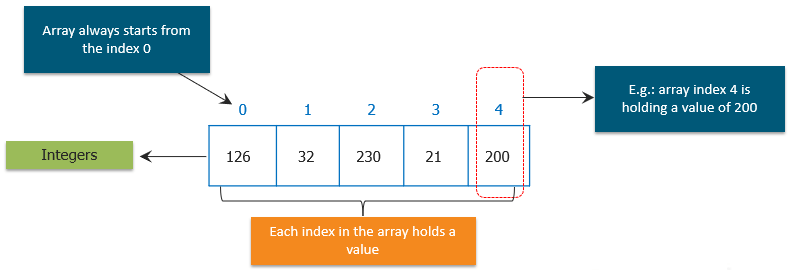
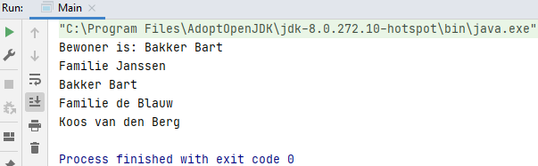

## Array

An array is variable that can hold a row of values. Also called collection.

Array always starts from the index 0.

### Example

    package Array;
    
    public class Main {
        public static void main(String[] args) {
            String[] bakkerstraat = new String[4];
            bakkerstraat[0] = "Familie Janssen";
            bakkerstraat[1] = "Bakker Bart";
            bakkerstraat[2] = "Familie de Blauw";
            bakkerstraat[3] = "Koos van den Berg";
    
            System.out.println("Bewoner is: " + bakkerstraat[1]);
    
            for (int index = 0; index < bakkerstraat.length; index++) {
                System.out.println(bakkerstraat[index]);
            }
        }
    }

Querying the length of an array is simple using 'length':
`int aantalWoningen = bakkerstreet.length`.

## Challenge

Allow the user of the program to type in some numbers. We're going to sum up those total numbers, and figure out the
averages of those numbers that were typed in.

Create two methods:
1. getIntegers
2. getAverage

Print out the result in main.