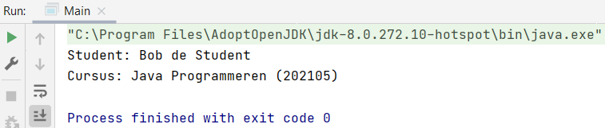

## Association

### Step 1
We have two classes: `Student.java` with two properties `firstName` and `lastName` and we have `Course.java` also with two properties `courseName` and `courseNo`.

In addition, for both we have a get method that return information, one `getFullName` and the other `getCourseInfo`.

### Step 2
In `Main.java` we turn the classes into objects.

Object for Student:

    Student student1 = new Student();

Object for Course:

    Course javaProgrammeren = new Course();

`student1.firstName` gets the value Bob

    student1.firstName = "Bob";

`javaProgrammeren.courseName` gets the value Java Programmeren

    javaProgrammeren.courseName = "Java Programmeren";

### Step 3

Calling the return in Student.java

    System.out.println("Student: " + student1.getFullName());

Calling the return in Course.java

    System.out.println("Cursus: " + javaProgrammeren.getCourseInfor());

### Full code

<i>Student.java</i>

    package nl.novi.opdracht2;
    
    public class Student {
        public String firstName;
        public String lastName;
    
        public String getFullName() {
            return firstName + " " + lastName;
        }
    }

<i>Course.java</i>

    package nl.novi.opdracht2;
    
        public class Course {
        public String courseName;
        public int courseNo;
    
        public String getCourseInfor(){
            return courseName + " (" + courseNo + ") ";
        }
    }

<i>Main.java</i>

    package nl.novi.opdracht2;
    
    public class Main {
    
        public static void main(String[] args) {
            Student student1 = new Student();
            student1.firstName = "Bob";
            student1.lastName = "de Student";
    
            Course javaProgrammeren = new Course();
            javaProgrammeren.courseName = "Java Programmeren";
            javaProgrammeren.courseNo = 202105;
    
            System.out.println("Student: " + student1.getFullName());
            System.out.println("Cursus: " + javaProgrammeren.getCourseInfor());
        }
    }

### Step 4

We're going to link the objects, we want to indicate that Bob is taking a particular course. We now have two objects that have no relationship to each other. Bob can only take one course at a time.

We create our own variable type Course in Student.java.

    public Course currentCourse;

Now it has a relationship with the class Course.java, but it is not completed yet. We create a new method in Student.java.

    public String getStudentAndCourseInfo(){
        return getFullName() + " volgt " + currentCourse.getCourseInfor();
    }

This method displays the student information and the course information.

### Step 5

In Main.java, we assign javaProgrammeren to student1.

    student1.currentCourse = javaProgrammeren;

Calling getStudentAndCourseInfo.

    System.out.println(student1.getStudentAndCourseInfo());

### Full code

<i>Student.java</i>

    package nl.novi.opdracht2;
    
    public class Student {
    public String firstName;
    public String lastName;
    public Course currentCourse;
    
        public String getFullName() {
            return firstName + " " + lastName;
        }
    
        public String getStudentAndCourseInfo(){
            return getFullName() + " volgt " + currentCourse.getCourseInfor();
        }
    }

<i>Main.java</i>

    package nl.novi.opdracht2;
    
    public class Main {
    
        public static void main(String[] args) {
            Student student1 = new Student();
            student1.firstName = "Bob";
            student1.lastName = "de Student";
    
            Course javaProgrammeren = new Course();
            javaProgrammeren.courseName = "Java Programmeren";
            javaProgrammeren.courseNo = 202105;
            student1.currentCourse = javaProgrammeren;
    
            System.out.println("Student: " + student1.getFullName());
            System.out.println("Cursus: " + javaProgrammeren.getCourseInfor());
            System.out.println(student1.getStudentAndCourseInfo());
        }
    }

### Step 6

Suppose you have multiple students, then you are going to repeat the following code from Main.java every time, `student1` becomes `student2`.

    package nl.novi.opdracht2;
    
    public class Main {
    
        public static void main(String[] args) {
            Student student1 = new Student();
            student1.firstName = "Bob";
            student1.lastName = "de Student";
    
            Student student2 = new Student();
            student2.firstName = "Danielle";
            student2.lastName = "de Student";
    
            Course javaProgrammeren = new Course();
            javaProgrammeren.courseName = "Java Programmeren";
            javaProgrammeren.courseNo = 202105;
            student1.currentCourse = javaProgrammeren;
            student2.currentCourse = javaProgrammeren;
    
            System.out.println("Student: " + student1.getFullName());
            System.out.println("Cursus: " + javaProgrammeren.getCourseInfor());
            System.out.println(student1.getStudentAndCourseInfo());
            System.out.println(student2.getStudentAndCourseInfo());
        }
    }

### Step 7

We create an ArrayList of type Student.

    ArrayList<Student> studenten = new ArrayList<>();

The package of ArrayList is automatically imported by IntelliJ.

    import java.util.ArrayList;

We add the students to the ArrayList.

    studenten.add(student1);
    studenten.add(student2);

### Step 8

Calling the students that we did manually...

    System.out.println(student1.getStudentAndCourseInfo());
    System.out.println(student2.getStudentAndCourseInfo());

...nut now we're going to do this with a for loop. We're going to loop through the array.

    for (int i = 0; i < studenten.size(); i++) {
        System.out.println(studenten.get(i).getStudentAndCourseInfo());
    }

### Full code

    package nl.novi.opdracht2;
    
    import java.util.ArrayList;
    
    public class Main {
    
        public static void main(String[] args) {
            Student student1 = new Student();
            student1.firstName = "Bob";
            student1.lastName = "de Student";
    
            Student student2 = new Student();
            student2.firstName = "Danielle";
            student2.lastName = "de Student";
    
            Course javaProgrammeren = new Course();
            javaProgrammeren.courseName = "Java Programmeren";
            javaProgrammeren.courseNo = 202105;
            student1.currentCourse = javaProgrammeren;
            student2.currentCourse = javaProgrammeren;
    
            ArrayList<Student> studenten = new ArrayList<>();
            studenten.add(student1);
            studenten.add(student2);
    
            for (int i = 0; i < studenten.size(); i++) {
                System.out.println(studenten.get(i).getStudentAndCourseInfo());
            }
    
    //        System.out.println("Student: " + student1.getFullName());
    //        System.out.println("Cursus: " + javaProgrammeren.getCourseInfor());
    //        System.out.println(student1.getStudentAndCourseInfo());
    //        System.out.println(student2.getStudentAndCourseInfo());
        }
    }

