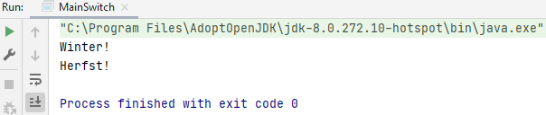
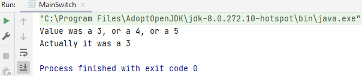
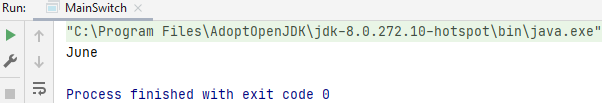

## Switch statement

The switch statement begins with the keyword `switch`. Between the brackets you put the variable you want to test. After each `case` you put a possible value for that variable and below that you write the code that should be executed when these match.

The `break` is added when you want to execute code from your switch only once and to prevent your code from going through the entire switch. That makes your application faster. The `default` is the same as the else in an if-else construction.

### Example switch statement currentSeason 

    int currentSeason = 0;
    
    switch (currentSeason) {
        case 1: // ga wandelen in de natuur
            System.out.println("Lente!");
            break;
        case 2: // ga liggen op het strand
            System.out.println("Zomer!");
            break;
        case 3: // ga steden bezoeken
            System.out.println("Herfst!");
            break;
        default: // het is winter, ga op wintersport
            System.out.println("Winter!");
            break;
    }

What if `currentSeason` is 6, we only have 4 seasons: we make an if statement around the switch statement.

We have additional conditions: if `anotherSeason` is greater than or equal to 0 AND less than 5, then you may execute the switch statement and otherwise you don't give anything back.

    int anotherSeason = 3;
    
    if (anotherSeason >= 0 && anotherSeason < 5) {
        switch (anotherSeason) {
            case 1: // ga wandelen in de natuur
                System.out.println("Lente!");
                break;
            case 2: // ga liggen op het strand
                System.out.println("Zomer!");
                break;
            case 3: // ga steden bezoeken
                System.out.println("Herfst!");
                break;
            default: // het is winter, ga op wintersport
                System.out.println("Winter!");
                break;
        }
    }

### Example switch statement switchValue

    int switchValue = 3;

    switch (switchValue) {
        case 1:
            System.out.println("Value was 1");
            break;
        case 2:
            System.out.println("Value was 2");
            break;
        case 3:
        case 4:
        case 5:
            System.out.println("Value was a 3, or a 4, or a 5");
            System.out.println("Actually it was a " + switchValue);
            break;
        default:
            System.out.println("Was not 1, 2, 3, 4 or 5");
            break;
    }

### Example switch with toUppercase()

With the `.toLowerCase()` or `toUppercase()` it doesn't matter how you write the word. Your case has to be written with lowercase or uppercase letters: this is a method that belongs to the `String`.

    String month = "JuNE";
    
    switch (month.toUpperCase()) {
        case "JANUARY":
            System.out.println("January");
            break;
        case "JUNE":
            System.out.println("June");
            break;
        default:
            System.out.println("Not sure");
    }

## Difference between if and switch

<i> If statement</i>

    int value = 1; // here you fill in the value, e.g. 1, 2 or 3

    if (value == 1) {
        System.out.println("Value was 1");
    } else if (value == 2) {
        System.out.println("Value was 2");
    } else { // else is always the default, if nothing else is possible
        System.out.println("Was not 1 or 2");
    }

<i>Switch statement</i>

When you want to test 10 values you should use switch.

With a switch, a variable can be tested for equality against a list of values. Each value is called a case and the switched variable is checked for each case when you reach a break keyword, it breaks out of the switch. This will stop the execution of more code and case testing within the block. Default means at any other case that's not been covered above.

    int valueSwitch = 3;
    
    switch (valueSwitch) {
        case 1:
            System.out.println("Value was 1");
            break;
        case 2:
            System.out.println("Value was 2");
            break;
        default:
            System.out.println("Was not 1 or 2");
            break;
    }

<i> Conclusion </i> 

You can use both if and switch statement, you'll get the same outcome. 
Switch is good to use if you're actually testing the same variable. You want to test different values for that variable.

## Main assignment

- Create a new switch statement using char instead of int. 
- Create a new char variable. 
- Create a switch statement testing for  A, B, C, D, or E. 
- Display a message if any of these are found and then break. 
- Add a default which displays a message saying not found.

## Day of the week assignment - switch and if statement

Write a method with the name `printDayOfTheWeek` that has one parameter of type int and name it day. The method should not return any value (hint: void)

Using a switch statement print "Sunday", "Monday", ... , "Saturday" if the int parameter "day" is 0, 1, ... , 6 respectively, otherwise it should print "Invalid day".

Bonus:  
Write a second solution using if then else, instead of using switch.