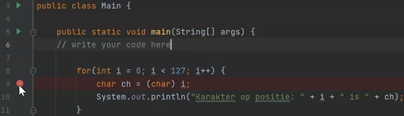
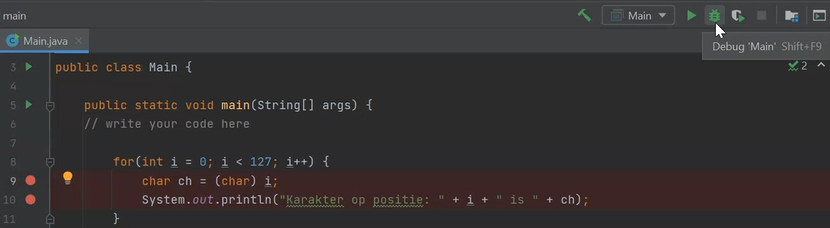
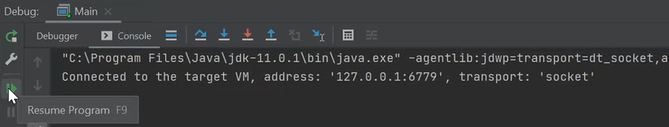
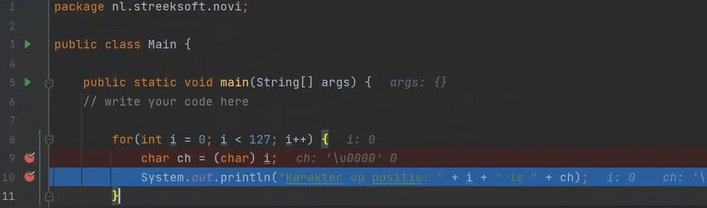

## Debugging

Debugging is used to analyze and solve problems (bugs). This is a process that you can pause your application while it is running, so if you have an error you can pause it on a line number and then you can find out where the error occurs and what the conditions are at that time when you are running your program:

- Determine where to pause the program.
    - this is done using breakpoints (breakpoints)
        - Red dot next to the line number (in IntelliJ).

        

- Breakpoints are special markers, which indicate certain lines when the debugger should intervene and pause the program state

- Run your program in debugging mode (the green "bug" icon within IntelliJ)

- Go to the next red line with resume program

- The grey text shows what it does, so for example: `i: 0` and `ch: \u0000` (character is u0000)

- After pausing the program, use the debugger to get information about the status of the program (for example, the contents of variables) and how it changes as it runs.
