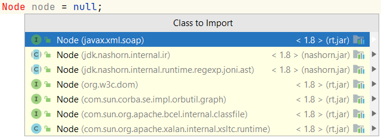

## Packages

Package is a way of grouping related classes and interfaces together.

Access to classes, variables and methods can be protected by using packages in combination with access modifiers (`public`, `private`, `protected`).

Examples of package names:
- java.util
- nl.novi.java

### Example #1

    Node node = null;

Two ways to add a class:
1. clicking on the `Class to import` and the package will be added automatically
2. fill it in in front of 'Node' (not imported)

        javax.xml.soap.Node node = null;

When are you doing option 2? When you have two different Node packages and Java give's an
error to choise wich one to use: you are allowed to have 1 import package and use option 2

      package E_Packages;
      
      import javax.xml.soap.Node;
      
      public class Main {
      
          public static void main(String[] args) {
              Node node = null;
          }
      }

### Example #2

<i>MyWindow.java</i>

      package E_Packages;
      
      import java.awt.*;
      import java.awt.event.WindowAdapter;
      import java.awt.event.WindowEvent;      

         public class MyWindow extends Frame {
            public MyWindow(String title) {
               super(title);
               setSize(500, 140);
               addWindowListener(new WindowAdapter() {
                  @Override
                     public void windowClosing(WindowEvent e) {
                        System.exit(0);
                  }
               });
         }
   
          @Override
          public void paint(Graphics g) {
              super.paint(g);
              Font sansSerifLarge = new Font("SansSerif", Font.BOLD, 18);
              Font sansSerifSmall = new Font("SansSerif", Font.BOLD, 12);
              g.setFont(sansSerifLarge);
              g.drawString("The Complete Java Developer Course", 60, 60);
              g.setFont(sansSerifSmall);
              g.drawString("by Tim Buchalka", 60, 100);
          }
      }           

- AWT = Abstract Window Toolkit
- the * means to import all the class interfaces and static objects from the java.awt class
- the import * would actually be doing everything, but here it's not actually the case: there are two different packages here: there's java.awt and there's java.awt.event

Most of the infrastructure code is automatically in these packages that have been provided by Java. So writing all
this yourself, writing a window manager that creates fonts, that actually sets different fonts that will have you to draw things on the screen, positioning it up certain places. That would be huge undertaking to do something
 yourself. 

<i>Example2.java</i>

      package E_Packages;
      
      public class Example2 {
      
          public static void main(String[] args) {
              MyWindow myWindow = new MyWindow("Complete Java");
              myWindow.setVisible(true);
          }
      }