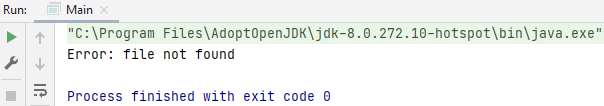
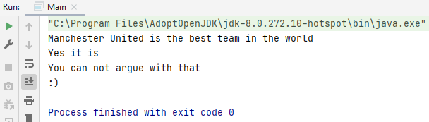

## File Input/Output

Within Java there are several solutions to create, modify or read files.

If you are going to work with files with Java, you should think of simple text files that you want to fill with data, you generally use the `java.io` package.

The `java.io` package contains the `File`, `FileReader` and `FileWriter` class, from these  classes you can create objects to work with files.
- Using the `File` class it is possible to create new files, check if a file / folder exists and if it is a file or folder, if a file / folder is hidden. In addition, a whole list of files can be requested from a certain folder, or a folder can be created.   
- `File a = new File("File.txt");`
- `boolean isFile = a.isFile();` because you are working with objects, you can call methods, like for example `a.isFile();` this is a method of the File class, which only checks if the given file is a file. This returns the boolean value true if it is a file.

Within the `java.util` package is the `Scanner` class where you can use, for example, the `hasNextLine` method to read a file by line. 

## Example

### File processing template
1. open the file / create the file
2. proces the file (read: input/write: output)
3. close the file

### I - File input (reading from a file)

#### 1. open the file

Create `I.txt` in the head file of the project.

Adding lines to it:

    Manchester United is the best team in the world
    Yes it is
    You can not argue with that
    :)

We are going to write code in Main.java that will read `I.txt` and print it out to the console.

    import java.io.File;
    import java.io.FileNotFoundException;
    import java.util.Scanner;
    
    public class Main {
    
        public static void main(String[] args) {
            Scanner inFile = null;
    
            try {
                inFile = new Scanner(new File("I.txt"));
            } catch (FileNotFoundException e) {
                System.out.println("Error: file not found");
            }
        }
    }

Test the error you made by leaving something out in the file name, instead of `I.txt` make it `Is.txt`.

    inFile = new Scanner(new File("Is.txt"));

#### 2. proces the file

    import java.io.File;
    import java.io.FileNotFoundException;
    import java.util.Scanner;
    
    public class Main {
    
        public static void main(String[] args) {
            Scanner inFile = null;
    
            try {
                inFile = new Scanner(new File("I.txt"));
                while (inFile.hasNextLine()){
                    String line = inFile.nextLine();
                    System.out.println(line);
                }
            } catch (FileNotFoundException e) {
                System.out.println("Error: file not found");
            }
        }
    }

#### 3. close the file

    import java.io.File;
    import java.io.FileNotFoundException;
    import java.util.Scanner;
    
    public class Main {
    
        public static void main(String[] args) {
            Scanner inFile = null;
    
            try {
                inFile = new Scanner(new File("I.txt"));
                while (inFile.hasNextLine()){
                    String line = inFile.nextLine();
                    System.out.println(line);
                }
                inFile.close();
            } catch (FileNotFoundException e) {
                System.out.println("Error: file not found");
            }
        }
    }

### O - File output (writing from a file)

#### 1. create the file

We are going to use `PrintStream`, but you can also use `FileWriter`: `PrintStream outFile = new PrintStream(new File("O.txt"));`.

    try {
        PrintStream outFile = new PrintStream(new File("O.txt"));
    } catch (FileNotFoundException e){
        System.out.println("Error: unable to open file for writing");
    }

#### 2. proces the file

    try {
        PrintStream outFile = new PrintStream(new File("O.txt"));
        outFile.println("NAC Breda");
    } catch (FileNotFoundException e){
        System.out.println("Error: unable to open file for writing");
    }

#### 3. close the file

    import java.io.File;
    import java.io.FileNotFoundException;
    import java.io.PrintStream;
    import java.util.Scanner;
    
    public class Main {
    
        public static void main(String[] args) {           
            try {
                PrintStream outFile = new PrintStream(new File("O.txt"));
                outFile.println("NAC Breda");
                outFile.close();
            } catch (FileNotFoundException e){
                System.out.println("Error: unable to open file for writing");
            }
        }
    }

When you run `Main.java` there will be a file called `O.txt` in the head file of the project with the text in it: `NAC Breda`.

#### 4. extra information

Suppose we want to print out 10 random numbers from 1 to 6 in `O.txt`.

    try {
        PrintStream outFile = new PrintStream(new File("O.txt"));
        outFile.println("NAC Breda");
        Random random = new Random();
        for (int i = 0; i < 10; i++) {
            outFile.println(random.nextInt(6) + 1);
        }
        outFile.close();
    } catch (FileNotFoundException e) {
        System.out.println("Error: unable to open file for writing");
    }

### Input and output code

    import java.io.File;
    import java.io.FileNotFoundException;
    import java.io.PrintStream;
    import java.util.Random;
    import java.util.Scanner;
    
    public class Main {
    
        public static void main(String[] args) {
            Scanner inFile = null;
    
            try {
                inFile = new Scanner(new File("I.txt"));
                while (inFile.hasNextLine()){
                    String line = inFile.nextLine();
                    System.out.println(line);
                }
                inFile.close();
            } catch (FileNotFoundException e) {
                System.out.println("Error: file not found");
            }
    
            try {
                PrintStream outFile = new PrintStream(new File("O.txt"));
                outFile.println("NAC Breda");
                Random random = new Random();
                for (int i = 0; i < 10; i++) {
                    outFile.println(random.nextInt(6) + 1);
                }
                outFile.close();
            } catch (FileNotFoundException e) {
                System.out.println("Error: unable to open file for writing");
            }
        }
    }