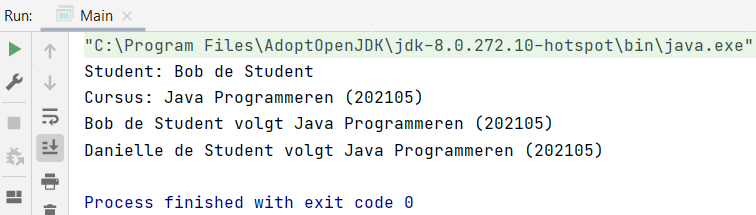

## Voorbeeld classes en objecten: associatie

### Stap 1:
We hebben twee classes: `Student.java` met twee eigenschappen `firstName` en `lastName` en we hebben C`ourse.java` ook met twee eigenschappen `coursenName` en `courseNo`.

Daarnaast hebben we voor beide een get methode die informatie teruggeven, de ene `getFullName` en de ander `getCourseInfo`.

### Stap 2
In `Main.java` maken we van de classes objecten.

Object voor Student:

    Student student1 = new Student();

Object voor Course:

    Course javaProgrammeren = new Course();

`student1.firstName` krijgt de waarde Bob

    student1.firstName = "Bob";

`javaProgrammeren.courseName` krijgt de waarde Java Programmeren

    javaProgrammeren.courseName = "Java Programmeren";

### Stap 3

Aanroepen van de return in Student.java

    System.out.println("Student: " + student1.getFullName());

Aanroepen van de return in Course.java

    System.out.println("Cursus: " + javaProgrammeren.getCourseInfor());

### Volledige code

<i>Student.java</i>

    package nl.novi.opdracht2;
    
    public class Student {
        public String firstName;
        public String lastName;
    
        public String getFullName() {
            return firstName + " " + lastName;
        }
    }

<i>Course.java</i>

    package nl.novi.opdracht2;
    
        public class Course {
        public String courseName;
        public int courseNo;
    
        public String getCourseInfor(){
            return courseName + " (" + courseNo + ") ";
        }
    }

<i>Main.java</i>

    package nl.novi.opdracht2;
    
    public class Main {
    
        public static void main(String[] args) {
            Student student1 = new Student();
            student1.firstName = "Bob";
            student1.lastName = "de Student";
    
            Course javaProgrammeren = new Course();
            javaProgrammeren.courseName = "Java Programmeren";
            javaProgrammeren.courseNo = 202105;
    
            System.out.println("Student: " + student1.getFullName());
            System.out.println("Cursus: " + javaProgrammeren.getCourseInfor());
        }
    }

### Stap 4

We gaan de objecten koppelen, we willen aangeven dat Bob een bepaalde cursus volgt. We hebben nu twee objecten die geen relatie met elkaar hebben. Bob kan maar één cursus tegelijkertijd volgen.

We maken in Student.java onze eigen variable type Course aan.

    public Course currentCourse;

Nu heeft hij een relatie met de klasse Course.java, maar hij wordt nog niet ingevuld. We maken een nieuwe methode aan in Student.java.

    public String getStudentAndCourseInfo(){
        return getFullName() + " volgt " + currentCourse.getCourseInfor();
    }

Deze methode geeft de student informatie en de cursus informatie weer.

### Stap 5

In Main.java wijzen we javaProgrammeren toe aan student1.

    student1.currentCourse = javaProgrammeren;

Het aanroepen van getStudentAndCourseInfo.

    System.out.println(student1.getStudentAndCourseInfo());

### Volledige code

<i>Student.java</i>

    package nl.novi.opdracht2;
    
    public class Student {
    public String firstName;
    public String lastName;
    public Course currentCourse;
    
        public String getFullName() {
            return firstName + " " + lastName;
        }
    
        public String getStudentAndCourseInfo(){
            return getFullName() + " volgt " + currentCourse.getCourseInfor();
        }
    }

<i>Main.java</i>

    package nl.novi.opdracht2;
    
    public class Main {
    
        public static void main(String[] args) {
            Student student1 = new Student();
            student1.firstName = "Bob";
            student1.lastName = "de Student";
    
            Course javaProgrammeren = new Course();
            javaProgrammeren.courseName = "Java Programmeren";
            javaProgrammeren.courseNo = 202105;
            student1.currentCourse = javaProgrammeren;
    
            System.out.println("Student: " + student1.getFullName());
            System.out.println("Cursus: " + javaProgrammeren.getCourseInfor());
            System.out.println(student1.getStudentAndCourseInfo());
        }
    }

### Step 6

Stel je hebt meerdere studenten, dan ga je de volgende code uit Main.java elke keer herhalen, `student1` wordt `student2`.

    package nl.novi.opdracht2;
    
    public class Main {
    
        public static void main(String[] args) {
            Student student1 = new Student();
            student1.firstName = "Bob";
            student1.lastName = "de Student";
    
            Student student2 = new Student();
            student2.firstName = "Danielle";
            student2.lastName = "de Student";
    
            Course javaProgrammeren = new Course();
            javaProgrammeren.courseName = "Java Programmeren";
            javaProgrammeren.courseNo = 202105;
            student1.currentCourse = javaProgrammeren;
            student2.currentCourse = javaProgrammeren;
    
            System.out.println("Student: " + student1.getFullName());
            System.out.println("Cursus: " + javaProgrammeren.getCourseInfor());
            System.out.println(student1.getStudentAndCourseInfo());
            System.out.println(student2.getStudentAndCourseInfo());
        }
    }

### Step 7

We maken een ArrayList van het type Student.

    ArrayList<Student> studenten = new ArrayList<>();

De package van ArrayList wordt door IntelliJ automatisch geïmporteerd.

    import java.util.ArrayList;

We voegen de studenten toe aan de ArrayList.

    studenten.add(student1);
    studenten.add(student2);

### Step 8

Het aanroepen van de studenten dat we handmatig doen:

    System.out.println(student1.getStudentAndCourseInfo());
    System.out.println(student2.getStudentAndCourseInfo());

Gaan we nu met een for loop doen. We gaan door de array heen loopen.

    for (int i = 0; i < studenten.size(); i++) {
        System.out.println(studenten.get(i).getStudentAndCourseInfo());
    }

### Volledige code

    package nl.novi.opdracht2;
    
    import java.util.ArrayList;
    
    public class Main {
    
        public static void main(String[] args) {
            Student student1 = new Student();
            student1.firstName = "Bob";
            student1.lastName = "de Student";
    
            Student student2 = new Student();
            student2.firstName = "Danielle";
            student2.lastName = "de Student";
    
            Course javaProgrammeren = new Course();
            javaProgrammeren.courseName = "Java Programmeren";
            javaProgrammeren.courseNo = 202105;
            student1.currentCourse = javaProgrammeren;
            student2.currentCourse = javaProgrammeren;
    
            ArrayList<Student> studenten = new ArrayList<>();
            studenten.add(student1);
            studenten.add(student2);
    
            for (int i = 0; i < studenten.size(); i++) {
                System.out.println(studenten.get(i).getStudentAndCourseInfo());
            }
    
    //        System.out.println("Student: " + student1.getFullName());
    //        System.out.println("Cursus: " + javaProgrammeren.getCourseInfor());
    //        System.out.println(student1.getStudentAndCourseInfo());
    //        System.out.println(student2.getStudentAndCourseInfo());
        }
    }

