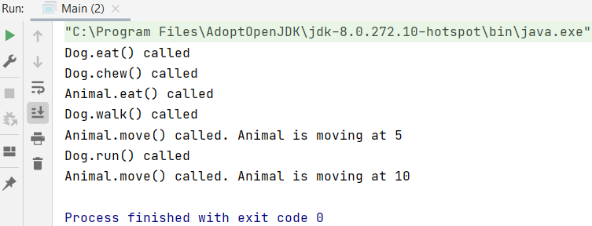

## Inheritance (overerving)

Suppose we have 2 separate classes with similar properties and methods.

Code.

Inheritance allows you to put a class above Kat and Hond that you inherit certain methods from: a superclass `Huisdier`. The classes that inherit are called subclasses (Kat and Hond).

We created a Huisdier class (superclass) that contains the shared methods of both classes. Kat and Hond still have their own constructor. Because they inherit from the Huisdier class, they automatically have access to `getNaam()` and `maakGeluid()` methods.

Code.

### Example1

<i>Main.java</i>

    package Overerving;
    
    public class Main {
        public static void main(String[] args) {
            Pet aPet = new Pet("Cat", "Freckle");
            Rabbit aRabbit = new Rabbit("Bugs Bunny", "Grey");
    
            System.out.println("Pet food: " + aPet.food());
            System.out.println("Rabbit food: " + aRabbit.food());
    
            System.out.println("Pet name: " + aPet.name);
            System.out.println("Rabbit name: " + aRabbit.name);
            
            System.out.println("Pet type: " + aPet.type);
            System.out.println("Rabbit type: " + aRabbit.type);
        }
    }
  
<i>Pet.java</i>

    package Overerving;
    
    class Pet {
        protected String type;
        protected String name;
    
        public Pet(String type, String name) {
            this.type = type;
            this.name = name;
        }
    
        public String food() {
            return "Nom nom";
        }
    }

<i>Rabbit.java</i>

    package Overerving;
    
    class Rabbit extends Pet {
        private String color;
    
        public Rabbit(String name, String color) {
            super("Rabbit", name);
            this.color = color;
        }
    
        public String food() {
            return "Rabbit rabbit rabbit";
        }
    }

@Override annotation informs the compiler that the element is meant to override an element declared in a superclass. While it is not required to use this annotation when overriding a method, it is a best practise and it helps to prevent errors.

    @Override
    public String food() {
        return "Rabbit rabbit rabbit";
    }

### Example2

Step 1: fields/states all animals have - Animal.java

    private String name;
    private int brain;
    private int body;
    private int size;
    private int weight;

Step 2: constructor - Animal.java

    public Animal(String name, int brain, int body, int size, int weight) {
        this.name = name;
        this.brain = brain;
        this.body = body;
        this.size = size;
        this.weight = weight;
    }

Step 3: getters - Animal.java

    public String getName() {
        return name;
    }

    public int getBrain() {
        return brain;
    }

    public int getBody() {
        return body;
    }

    public int getSize() {
        return size;
    }

    public int getWeight() {
        return weight;
    }

Step 4: if you want to inherit from another class, (you want to be able to access), you use the extends keyword - Dog.java

    public class Dog extends Animal {

Step 5: make a constructor for the dog class that calls that other class - Dog.java

    public Dog(String name, int brain, int body, int size, int weight) { 
        super(name, brain, body, size, weight);

Super: is to call the constructor that is for the class that we're extending from, in this case the superclass

Step 6: assign extra states/fields that dogs have - Dog.java

    private int eyes;
    private int legs;
    private int tail;
    private int teeth;
    private String coat;

Step 7: initialize the dog fields in the constructor - Dog.java  
Deleting parameters, and put 1 is saying: all dogs have a brain/body  
Type de dog parameters into the constructor + initialize the fields by doing this

    public Dog(String name, int size, int weight, int eyes, int legs, int tail, int teeth, String coat) {
        super(name, 1, 1, size, weight);
        this.eyes = eyes;
        this.legs = legs;
        this.tail = tail;
        this.teeth = teeth;
        this.coat = coat;
    }

Step 8: creating a new Animal object - Main.java

    Animal animal = new Animal("Animal", 1, 1, 5, 5);

Step 9: creating a new Dog object - Main.java

    Dog dog = new Dog("Yorkie", 8, 20, 2, 4, 1, 20, "long silky");

Step 10: adding behaviors, methods, that animals do - Animal.java

    public void eat() {
        System.out.println("Animal.eat() called");
    }

Step 11: this method comes from animal and is publicly accessible by dog - Main.java

    dog.eat();
    dog.walk();
    dog.run();

Step 12: a dog does not eat, but chew, so a unique private method - Dog.java

    private void chew() {
        System.out.println("Dog.chew() called");
    }

Step 13: use the override method to create a version of that same method that exists in the Animal class, but make it unique for the Dog class - Dog.java

    @Override //created by Java
    public void eat() { //created by Java
        System.out.println("Dog.eat() called");
        chew();
        super.eat(); //created by Java
    }

Step 14: new method. (int speed) means how fast the animal is - Animal.java

    public void move(int speed) {
        System.out.println("Animal.move() called. Animal is moving at " + speed);
    }

Step 15: use method 'move' from Animal. How does a dog move? Walk and run - Dog.java

    public void walk() {
    System.out.println("Dog.walk() called");
    super.move(5);
    }

    public void run() {
        System.out.println("Dog.run() called");
        super.move(10);
    }

### Full code

<i>Animal.java</i>

    package Inheritance.Example2;
    
    public class Animal {        
        private String name;
        private int brain;
        private int body;
        private int size;
        private int weight;
    
        public Animal(String name, int brain, int body, int size, int weight) {
            this.name = name;
            this.brain = brain;
            this.body = body;
            this.size = size;
            this.weight = weight;
        }

        public void eat() {
            System.out.println("Animal.eat() called");
        }
    
        public void move(int speed) {
            System.out.println("Animal.move() called. Animal is moving at " + speed);
        }
    
        public String getName() {
            return name;
        }
    
        public int getBrain() {
            return brain;
        }
    
        public int getBody() {
            return body;
        }
    
        public int getSize() {
            return size;
        }
    
        public int getWeight() {
            return weight;
        }
    }

<i>Dog.java</i>

    package Inheritance.Example2;
    
    public class Dog extends Animal {
        private int eyes;
        private int legs;
        private int tail;
        private int teeth;
        private String coat;
    
        public Dog(String name, int size, int weight, int eyes, int legs, int tail, int teeth, String coat) {
            super(name, 1, 1, size, weight);
            this.eyes = eyes;
            this.legs = legs;
            this.tail = tail;
            this.teeth = teeth;
            this.coat = coat;
        }
    
        private void chew() {
            System.out.println("Dog.chew() called");
        }
    
        @Override //created by Java
        public void eat() { //created by Java
            System.out.println("Dog.eat() called");
            chew();
            super.eat(); //created by Java
        }
    
        public void walk() {
            System.out.println("Dog.walk() called");
            super.move(5);
        }
    
        public void run() {
            System.out.println("Dog.run() called");
            super.move(10);
        }
    }

<i>Main.java</i>

    package Inheritance.Example2;
    
    public class Main {
    
        public static void main(String[] args) {
            Animal animal = new Animal("Animal", 1, 1, 5, 5);
    
            Dog dog = new Dog("Yorkie", 8, 20, 2, 4, 1, 20, "long silky");
    
            dog.eat();
            dog.walk();
            dog.run();
        }
    }

