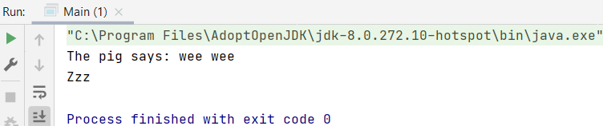

## Interfaces

An interface is a special kind of class, which basically (except for any constants) has no attributes (properties, variables). An interface does have abstract methods.

Het idee van een interface is dat je een soort raamwerk geeft die beschrijft de klasse die de interface gaat implementeren wat hij moet overnemen om te voldoen aan de interface.

Bij het gebruik van een interface gebruik je het woordje `implements`.

When another class implements an interface, the abstract methods must be overridden.

It is possible to implement multiple interfaces in 1 class. 

It is possible to both inherit 1 other class, and implement 1 or more interfaces. 

### Example1

Interface `Animal.java`

    interface Animal {
        public void animalSound(); 
        public void sleep(); 
    }

The interface methods `animalSound()` and `sleep()` do not have a body.

`Pig.java` "implements" the Animal interface

    class Pig implements Animal {
        public void animalSound() {
            // The body of animalSound() is provided here
            System.out.println("The pig says: wee wee");
        }
        public void sleep() {
            // The body of sleep() is provided here
            System.out.println("Zzz");
        }
    }

    class Main {
        public static void main(String[] args) {
            Pig myPig = new Pig();  // Create a Pig object
            myPig.animalSound();
            myPig.sleep();
        }
    }

