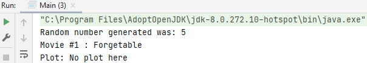

## Polymorphism

Polymorphism means <i>many forms</i>, and it occurs when we have many classes that are related to each other by inheritance.

Inheritance lets us inherit attributes and methods from another class. Polymorphism uses those methods to perform different tasks. This allows us to perform a single action in different ways.

### Example1

Think of a superclass called `Animal` that has a method called `animalSound()`. Subclasses of Animals could be `Pigs`, `Dogs` - And they also have their own implementation of an animal sound (the pig oinks, and the cat barks, etc.):

<i>Animal.java</i>

    class Animal {
        public void animalSound() {
            System.out.println("The animal makes a sound");
        }
    }

<i>Pig.java</i>    

    class Pig extends Animal {
        public void animalSound() {
            System.out.println("The pig says: wee wee");
        }
    }

<i>Dog.java</i>

    class Dog extends Animal {
        public void animalSound() {
            System.out.println("The dog says: bow wow");
        }
    }

Now we can create `Pig` and `Dog` objects and call the `animalSound()` method on both of them.

<i>Main.java</i>

    class Main {
        public static void main(String[] args) {
            Animal myAnimal = new Animal();  
            Animal myPig = new Pig();  
            Animal myDog = new Dog();  

            myAnimal.animalSound();
            myPig.animalSound();
            myDog.animalSound();
        }
    }

When creating the objects you see that 3 times the word `Animal` is used, since you are working with subclasses you can create a `Pig` and `Dog` object with the name of the superclass.

### Example2

#### Step 1: class Movie

    class Movie {
    }

#### Step 2: variable

    private String name;

#### Step 3: constructor

    public Movie(String name) {
        this.name = name;
    }

#### Step 4: method plot

    public String plot() {
        return "No plot here";
    }

#### Step 5: getter

    public String getName() {
        return name;
    }

#### Step 6: class Jaws is inheritance from Movie

Constructor and method.

    class Jaws extends Movie {
        public Jaws() {
            super("Jaws");
        }

    
        public String plot() {
            return "A shark eats lots of people";
        }
    }

#### Step 7: class IndependenceDay is inheritance from Movie

Constructor and method using override.

    class IndependenceDay extends Movie {
        public IndependenceDay() {
            super("Independence Day");
        }
    
        @Override
        public String plot() {
            return "Aliens attempt to take over planet earth";
        }
    }

#### Step 8: class MazeRunner is inheritance from Movie

Constructor and method using override.

    class MazeRunner extends Movie {
        // constructor
        public MazeRunner() {
            super("Maze Runner");
        }
    
        // method using override
        @Override
        public String plot() {
            return "Kids try and escape a maze";
        }
    }

#### Step 9: class StarWars is inheritance from Movie

Constructor and method using override.

    class StarWars extends Movie {
        public StarWars() {
            super("Star Wars");
        }
    
        @Override
        public String plot() {
            return "Imperial Forces try to take over the universe";
        }
    }

#### Step 10: class Forgetable is inheritance from Movie

Constructor but no method. This one makes sense how polymorphism works.

    class Forgetable extends Movie {
        public Forgetable() {
            super("Forgetable");
        }
    }

#### Step 11: method randomMovie  - Main.java

Purpose of this method is to return a random movie.

    public static Movie randomMovie() {
    }

#### Step 12: method randomMovie  - Main.java

In order to be able to return a random movie, we need to generate a random number each time that this method is called, a random movie is selected: math function

By default this will return a random number, a double between 0 and 1. So, what we're doing is we're converting that to an integer (int), and then we're multiplying it, in this case, by 5. So, by doing that, that's going to return a random number in the range 0 to 4. And what we're gonna do then is add 1 to that: in other words we're going to return a number between 1 and 5.

    int randomNumber = (int) (Math.random() * 5) +1;
    System.out.println("Random number generated was: " + randomNumber);

#### Step 13: create the movie classes with switch - Main.java

No break needed, because we've got a return in there as the first line.

    switch (randomNumber) {
        case 1:
            return new Jaws();
        case 2:
            return new IndependenceDay();
        case 3:
            return new MazeRunner();
        case 4:
            return new StarWars();
        case 5:
            return new Forgetable();
        default:
            return null;
    }
        
Each time we call this `randomMovie` method, we should get a random movie returned to us take a look at the fact that we're actually returning the movies the super class in this case, Movie, because all these classes actually inherit from Movie and that's why we can use that once to apply to all these classes because of the way inheritance works we can use that is a relationship: Jaws is a movie, Independence day is a movie etc.

#### Step 14: for loop - Main.java

for loop that goes through a number of times retrieving a random movie and then start using that polymorphism: to actually call the relevant plot method for that class

    for (int i = 1; i < 11; i++) {

#### Step 15: create a variable Movie movie, and the movie object = randomMovie() - Main.java

    Movie movie = randomMovie();
    System.out.println("Movie #" + i +
            " : " + movie.getName() + "\n" +
            "Plot: " + movie.plot() + "\n"); 

`movie.plot` is the definition how polymorphism works.

What it's actually doing: it's looking at the object called movie, the variable that we created, that was returned from the random movie method. And then it's going down and looking into that object and  seeing, has it got a plot method?

Forgetable has no plot and it prints out: 'No plot here' because in the movie class the return said this.

