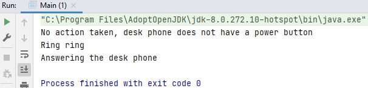

## Example3

An interface specifies methods that when a particular class implements the interface must implement the interface itself is abstract. That means there's no code for any of the methods, you only supply the method names and the parameters. The code still goes in the class that you're creating.

Use an interface to provide a common behavior that can be used by several classes by having them all implement the same interface. So it's really a way to standardize the way a particular set of classes is used.

#### Step 1: method operateClutch - Gearbox.java 

A parameter called in or out. If the string value is set to the value 'in' then clutch boolean field is set to true otherwise it's set to false.

    public void operateClutch(String inOrOut) {
        this.clutchIsIn = inOrOut.equalsIgnoreCase("in");
    }

#### Step 2: changed method operateClutch - Gearbox.java 

Changed String to boolean and deleted `.equalsIgnoreCase("in")` from step 1.

The method code has changed, problem: if you've got some other code that is reliant, that needs to change aswell.

    public void operateClutch(boolean inOrOut) {
        this.clutchIsIn = inOrOut;
    }

#### Step 3: solve the problem with an interface - Gearbox.java

An interface is a commitment that the method's signatures and variables in the interface constants (if defined) will not change.

#### Step 4: create an interface: ITelephone.java

ITelephone.java is the interface: I stands for Interface.

#### Step 5: define the methods - ITelephone.java

`Public interface ITelephone`: instead of class it says interface.

Define the methods, that are going to be used in this interface that when a class implements this interface needs to actually implement.

    public interface ITelephone {
        public void powerOn();
        public void dial(int phoneNumber);
        public void answer();
        public boolean callPhone(int phoneNumber);
        public boolean isRinging();
    }

These are the parameters, the name, the return type and any parameters, but we're not actually defining the actual code itself. That still goes into the class that inherits this interface.

You can delete the public, because these parameters are in the class, you don't need them here.

#### Step 6: implementing the interface - DeskPhone.java 

    public class DeskPhone implements ITelephone {
    }

#### Step 7: implement methods - DeskPhone.java

You need to implement ALL the methods from the interface.

    @Override
    public void powerOn() {
        System.out.println("No action taken, desk phone does not have a power button");
    }

    @Override
    public void dial(int phoneNumber) {
        System.out.println("Now ringing " + phoneNumber + " on deskphone");
    }

    @Override
    public void answer() {
        if (isRinging) {
            System.out.println("Answering the desk phone");
            isRinging = false;
        }
    }

    @Override
    public boolean callPhone(int phoneNumber) {
        if (phoneNumber == myNumber) {
            isRinging = true;
            System.out.println("Ring ring");
        } else {
            isRinging = false;
        }
        return isRinging;
    }

    @Override
    public boolean isRinging() {
        return isRinging;
    }

#### Step 8: create variables - DeskPhone.java

    private int myNumber;
    private boolean isRinging;

#### Step 9: create constructor - DeskPhone.java

    public DeskPhone(int myNumber) {
        this.myNumber = myNumber;
    }

#### Step 10: create an instance - Main.java

You can't do: `ITelephone timsPhone = new ITelephone(123456);` because: we have to find an interface but the actual class implementation in this case deskphone is the specific functionality for a certain type of telephone. So the interface is there at an abstract level to tell you what methods are valid and have to be actually overridden in an actual class. So that's why you can't actually instantiate it using the Itelephone interface.

    ITelephone timsPhone;
    timsPhone = new DeskPhone(123456);
    timsPhone.powerOn();
    timsPhone.callPhone(123456);
    timsPhone.answer();

