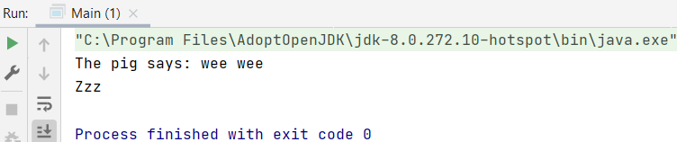
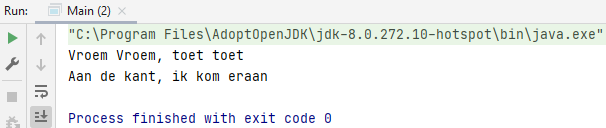

## Interfaces

An interface is a special kind of class, which is actually not a class, you have to implement it before you can use it. When using an interface, use the word `implements`. It is possible to implement more than 1 interface.

An interface has no attributes (properties, variables), except for any constants. It is a reference type in Java, it is similar to class, it is a collection of abstract methods.

Writing an interface is similar to writing a class. But a class describes the attributes and behaviours of an object. And an interface contains behaviours that a class implements.

When another class implements an interface, the abstract methods must be overridden.

It is possible to both inherit 1 other class, and implement 1 or more interfaces. 

### Example1

Interface `Animal.java`

    interface Animal {
        public void animalSound(); 
        public void sleep(); 
    }

The interface methods `animalSound()` and `sleep()` do not have a body.

`Pig.java` "implements" the Animal interface.

    class Pig implements Animal {
        public void animalSound() {
            // The body of animalSound() is provided here
            System.out.println("The pig says: wee wee");
        }
        public void sleep() {
            // The body of sleep() is provided here
            System.out.println("Zzz");
        }
    }

    class Main {
        public static void main(String[] args) {
            Pig myPig = new Pig();  // Create a Pig object
            myPig.animalSound();
            myPig.sleep();
        }
    }

### Example2

<i>Bestuurbaar.java</i>

    public interface Bestuurbaar {
        public abstract void besturen();
    }

<i>Auto.java</i>

Method "besturen" is overwritten by class Auto.

    public class Auto implements Bestuurbaar {
    
        @Override 
        public void besturen() {
            System.out.println("Vroem Vroem, toet toet");
        }
    }

<i>Step</i>

Method "besturen" is overwritten by class Step.

    public class Step implements Bestuurbaar {
    
        @Override 
        public void besturen() {
            System.out.println("Aan de kant, ik kom eraan");
        }
    }

<i>Main.java</i>

An ArrayList named voertuigen is created, this ArrayList is of type Bestuurbaar. So we have created a list based on the type of the interface and then you can add classes that implement the interface to the collection.

    ArrayList<Bestuurbaar> voertuigen = new ArrayList();

Object created from class Auto and class Step.

    Auto auto = new Auto();
    Step step = new Step();

Here Auto class and Step class are added to voertuigen ArrayList.

    voertuigen.add(auto); 
    voertuigen.add(step); 

This for-loop runs through the list of voertuigen and calls them with the controls method.

    for (Bestuurbaar b : voertuigen) {
        b.besturen();
    }

