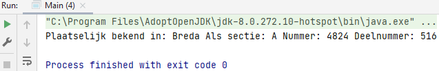
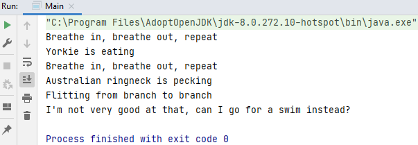

## Abstract classes

Abstract to a class indicates the class cannot be instantiated (i.e., no object can be created from the class). The idea behind this is that an abstract class is extended by other classes.

Classes that inherit from an abstract class have a contract and are required to override the abstract methods from the superclass.

An abstract class permits you to make functionality that subclasses can implement or override whereas an interface only permits you to state functionality but not to implement it. A class can extend only one abstract class while a class can implement multiple interfaces.

When using an abstract class, use the word `extends`.

> An abstract class has no use, no value and no reason to live.

Een abstracte klasse is een klasse die gebruik je nooit voor een concreet object. Je moet deze klasse altijd kunnen overerven.

### Example

Abstract class

    abstract class Animal {
      public abstract void animalSound();
      public void sleep() {
        System.out.println("Zzz");
      }
    }

Abstract method `animalSound()` does not have a body. Method `sleep()` is a regular method.

Subclass (inherit from Animal).

    class Pig extends Animal {
      public void animalSound() {
        // The body of animalSound() is provided here
        System.out.println("The pig says: wee wee");
      }
    }

    class Main {
      public static void main(String[] args) {
        Pig myPig = new Pig(); // Create a Pig object
        myPig.animalSound();
        myPig.sleep();
      }
    }

### Example2

<i>Woning.java</i>

Attributes/variables.

    protected String gemeente;
    protected String sectie;
    protected int nummer;

Constructor.

    public Woning(String gemeente, String sectie, int nummer) {
        this.gemeente = gemeente;
        this.sectie = sectie;
        this.nummer = nummer;
    }

Getters and setters abstract (empty).

    public abstract String getGemeente();

    public abstract void setGemeente(String gemeente);

    public abstract String getSectie();

    public abstract void setSectie(String sectie);

    public abstract int getNummer();

    public abstract void setNummer(int nummer);

Method `geefRegistratie`.

    public void geefRegistratie() {
        String x = "Plaatselijk bekend in: " + this.gemeente + " Als sectie: " + this.sectie + " Nummer: " + this.nummer;
        System.out.println(x);
    }

<i>Flat.java</i>

    public class Flat extends Woning {
        private int deelnummer;
    
        public Flat(String gemeente, String sectie, int nummer, int deelnummer) {
            super(gemeente, sectie, nummer);
            this.deelnummer = deelnummer;
        }
    
        @Override
        public String getGemeente() {
            return this.gemeente;
        }
    
        @Override
        public void setGemeente(String gemeente) {
            this.gemeente = gemeente;
        }
    
        @Override
        public String getSectie() {
            return this.sectie;
        }
    
        @Override
        public void setSectie(String sectie) {
            this.sectie = sectie;
        }
    
        @Override
        public int getNummer() {
            return this.nummer;
        }
    
        @Override
        public void setNummer(int nummer) {
            this.nummer = nummer;
        }
    
        public int getDeelnummer() {
            return deelnummer;
        }
    
        public void setDeelnummer(int deelnummer) {
            this.deelnummer = deelnummer;
        }
            
        @Override
        public void geefRegistratie() {
            String x = "Plaatselijk bekend in: " + this.gemeente + " Als sectie: " + this.sectie + " Nummer: " + this.nummer + " Deelnummer: " + this.deelnummer;
            System.out.println(x);
        }
    }

Method `giveRegistration` is overwritten from Woning.java.

<i>Main.java</i>

    public class Main {
    
        public static void main(String[] args) {
            Flat myFlat = new Flat("Breda", "A", 4824, 516); // flat object
            myFlat.geefRegistratie(); 
        }
    }

### Example3

#### Step 1: making the class abstract  - Animal.java

    public abstract class Animal {
    }

#### Step 2: variable - Animal.java

    private String name;

#### Step 3: constructor - Animal.java

    public Animal(String name) {
        this.name = name;
    }

#### Step 4: method, use abstract - Animal.java

    public abstract void eat();

    public abstract void breathe();

#### Step 5: getter 

    public String getName() {
        return name;
    }

We're going to inherit from this abstract class. It's going to let us define behaviors that are necessary, without specifying how they are to be performed.

With interface you saw that the entire interface was abstract, and there's no implementation whatsoever.

There's no opportunity for us to enter fields. There wasn't any opportunity for us to enter any other code. We purely were able just to specify the methods that were gonna be used for that interface, that a class that was implementing that particular interface had to actually fulfil in order to make it valid. But as you can see in the case of Animal, we can mix it up. We can add fields, we can add regular methods, or a constructor.

#### Step 6: Dog extends from Animal - Dog.java

    public class Dog extends Animal {
    }

#### Step 7: constructor - Dog.java

    public Dog(String name) {
        super(name);
    }

#### Step 8: override methods - Dog.java

    @Override
    public void eat() {
        System.out.println(getName() + " is eating");
    }

    @Override
    public void breathe() {
        System.out.println("Breathe in, breathe out, repeat");
    }

The important thing here is that not all methods have to be abstract. This is one of the differences between an abstract class and an interface, you can actually mix these up.

#### Step 9: create an instance - Main.java

    Dog dog = new Dog("Yorkie");
    dog.breathe();
    dog.eat();

Abstraction is when you define the required functionality for something without actually implementing the data house. In other words, we're focusing on what needs to be done, not on the how it's to be done abstract classes, these are classes that define methods, but do not provide an implementation of those methods. The implementation itself is left to the classes that inherit from the abstract class. This is different from inheriting from an interface.

#### Step 10: abstract class Bird extends from abstract class Animal - Bird.java

    public abstract class Bird extends Animal {
    }

#### Step 11: constructor - Bird.java

    public Bird(String name) {
        super(name);
    }

#### Step 12: override methods - Bird.java

    @Override
    public void eat() {
        System.out.println(getName() + " is pecking");
    }

    @Override
    public void breathe() {
        System.out.println("Breathe in, breathe out, repeat");
    }

#### Step 13: add abstract method fly - Bird.java

    public abstract void fly();

It's implementing the required methods that the Animal class requires it to, namely eat and breathe. But it's also defining an abstract method fly.

You can't directly instantiate a class that is abstract in anyway (can't put in the main class). So what we need to do is create another class: `parrot.java`.

#### Step 14: Parrot extends from Bird - Parrot.java

    public class Parrot extends Bird {
    }

#### Step 15: constructor - Parrot.java

    public Parrot(String name) {
        super(name);
    }

#### Step 16: override method fly - Parrot.java

Parrots automatically eat and breath from Bird, so we don't have to re-implement those methods again.

    @Override
    public void fly() {
        System.out.println("Flitting from branch to branch");
    }

#### Step 17: create an instance - Main.java

    Parrot parrot = new Parrot("Australian ringneck");
    parrot.breathe();
    parrot.eat();
    parrot.fly();

#### Step 18: Penguin extends from Bird - Penguin.java

    public class Penguin extends Bird {
    }

#### Step 19: constructor - Penguin.java

    public Penguin(String name) {
        super(name);
    }

#### Step 20: override method fly - Penguin.java

Penguins automatically eat and breath from Bird, so we don't have to re-implement those methods again.

    @Override
    public void fly() {
        System.out.println("I'm not very good at that, can I go for a swim instead?");
    }

#### Step 21: create an instance - Main.java

    Penguin penguin = new Penguin("Emperor");
    penguin.fly();

