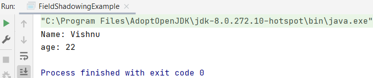
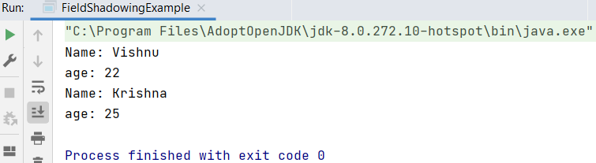

## Scope

Scope refers to the accessibility of a class, member, or variable.

You have several types:
- Class scope (variable available within entire class)
- Method scope (variable available within 1 method)
- Loop scope (variable available within 1 loop)
- Bracket scope (variable available within brackets; does not use this)

Suppose you go to buy a computer, you find a local store and they have the computer for 20% off. You can get the same computer at another store for full price. So the scope, or price reduction is only in that one local store. If Walmart decided to offer a discount on a particular computer, the discount would apply in about 4,500 stores across America. So in that context, the scope of the discount is much larger. If they were to apply the discount globally, the scope would be over 11,000 stores. The important thing here is that Walmart's discount does not apply to other stores. The scope is limited to the stores that are only controlled by Walmart.

Tip: Think carefully in advance about what times you will need a variable.

### Example

<i>ScopeCheck.java</i>

Step 1: variables

    public int publicVar = 0;
    private int privateVar = 1;

Step 2: constructor

    public ScopeCheck() {
        System.out.println("ScopeCheck created, publicVar = " + publicVar + ": privateVar = " + privateVar);
    }

Step 3: getter

    public int getPrivateVar() {
        return privateVar;
    }

<i>Main.java</i>

Step 4: create new instance: this is the local variable of Main.java

> privateVar in Main.java and privateVar in ScopeCheck.java are not the same (!)

    String privateVar = "this is private to main()";

Step 5: create an instance of ScopeCheck

    ScopeCheck scopeInstance = new ScopeCheck();
    System.out.println("scopeInstance privateVar is " + scopeInstance.getPrivateVar()); // privateVar from ScopeCheck.java
    System.out.println(privateVar); // privateVar local variable from Main.java

<i>ScopeCheck.java</i>

Step 6: method timesTwo

    public void timesTwo() {
        int privateVar = 2; // not the same pivateVar as the other two, this one is local to this method
        for (int i = 0; i < 10; i++) {
            System.out.println(i + " times two is " + i * privateVar);
        }
    }

<i>Main.java</i>

Step 7: print out method

It uses the privateVar from within the method and not the other two.

    scopeInstance.timesTwo();

#### Full code

<i>ScopeCheck.java</i>

    package M_Scope;
    
    public class ScopeCheck {
        public int publicVar = 0;
        private int privateVar = 1;
    
        public ScopeCheck() {
            System.out.println("ScopeCheck created, publicVar = " + publicVar + ": privateVar = " + privateVar);
        }
    
        public int getPrivateVar() {
            return privateVar;
        }
    
        public void timesTwo() {
            int privateVar = 2; // not the same pivateVar as the other two, this one is local to this method
            for (int i = 0; i < 10; i++) {
                System.out.println(i + " times two is " + i * privateVar);
            }
        }
    }

<i> Main.java</i>

    package M_Scope;
    
    public class Main {
    
        public static void main(String[] args) {
            String privateVar = "this is private to main()";
    
            ScopeCheck scopeInstance = new ScopeCheck();
            System.out.println("scopeInstance privateVar is " + scopeInstance.getPrivateVar()); // privateVar from ScopeCheck.java
            System.out.println(privateVar); // privateVar local variable from Main.java
    
            scopeInstance.timesTwo();
        }
    }

## Variable Shadowing
If the instance variable and local variable have the same name whenever you print (access) it in the method, the value of the local variable will be printed (shadowing the instance variable).

- Local variables − Variables defined inside methods, constructors or blocks are called local variables. The variable will be declared and initialized within the method and the variable will be destroyed when the method has completed.
- Instance variables − Instance variables are variables within a class but outside any method. These variables are initialized when the class is instantiated. Instance variables can be accessed from inside any method, constructor or blocks of that particular class.

### Example
In the following Java example, the class FieldShadowingExample has two instance variables (name, age) and a method (display()).

In the method there are two variables same as the instance variables (name and type).

When you invoke print (access) them in the method, the local variable values will be printed shadowing the instance ones.

    package M_Scope;
    
    public class FieldShadowingExample {
        String name = "Krishna";
        int age = 25;
    
        public void display() {
            String name = "Vishnu";
            int age = 22;
            System.out.println("Name: " + name);
            System.out.println("age: " + age);
        }
    
        public static void main(String args[]) {
            new FieldShadowingExample().display();
        }
    }

If you still, need to access the values of instance variables in a method (in this case) you need to access them using `this` keyword (or object) as shown below.

    package M_Scope;
    
    public class FieldShadowingExample {
        String name = "Krishna";
        int age = 25;
    
        public void display() {
            String name = "Vishnu";
            int age = 22;
            System.out.println("Name: " + name);
            System.out.println("age: " + age);
            System.out.println("Name: "+this.name);
            System.out.println("age: "+this.age);
        }
    
        public static void main(String args[]) {
            new FieldShadowingExample().display();
        }
    }

