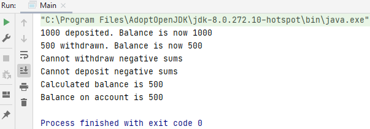
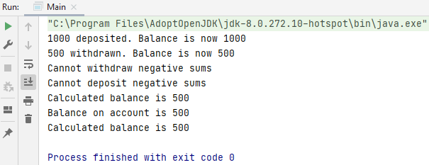

## Access Modifiers

Access modifiers: keywords private, public, protected.

With the access modifiers, you determine which other code can access your code.

- If you want to make your code (for example a method) accessible to everyone, then use `public`.
- If you want your instance variables or methods to be accessible only within the class, use `private`.
- In addition, `protected` allows you to make the code accessible to all subclasses and the code in the same package.

### Example AccessModifiers1

#### Step 1: create class Account.java

#### Step 2: variables - Account.java

Variable are all public.

    public String accountName;
    public int balance = 0;
    public ArrayList<Integer> transactions;

#### Step 3: constructor + initialize transactions - Account.java

    public Account(String accountName) {
        this.accountName = accountName;
        this.transactions = new ArrayList<Integer>();
    }

#### Step 4: getter - Account.java

    public int getBalance() {
        return balance;
    }

#### Step 5: method deposit - Account.java

What we're going to do is store the amounts as a positive number where it's a deposit, and a negative number for withdraw, and put those in the arraylist.

    public void deposit(int amount) {
        if (amount > 0) {
            transactions.add(amount);
            this.balance += amount;
            System.out.println(amount + " deposited. Balance is now " + this.balance);
        } else {
            System.out.println("Cannot deposit negative sums");
        }
    }

#### Step 6: method withdraw - Account.java

A negative number we're considering to be withdraw.

    public void withdraw(int amount) {
        int withdrawal = -amount;
        if (withdrawal < 0) {
            this.transactions.add(withdrawal);
            this.balance += withdrawal;
            System.out.println(amount + " withdrawn. Balance is now " + this.balance);
        } else {
            System.out.println("Cannot withdraw negative sums");
        }
    }

#### Step 7: method calculateBalance - Account.java

We start on zero and we can go through and get all the transactions.

    public void calculateBalance() {
        this.balance = 0;
        for (int i : this.transactions) {
            this.balance += i;
        }
        System.out.println("Calculated balance is " + this.balance);
    }

#### Step 8: doing transactions - Main.java

Everything's public in the Account class (account name, balance and transactions) and this allows any program using the Account class to modify the balance directly.

    Account daniellesAccount = new Account("Danielle");
    daniellesAccount.deposit(1000);
    daniellesAccount.withdraw(500);
    daniellesAccount.withdraw(-200);
    daniellesAccount.deposit(-20);
    daniellesAccount.calculateBalance();

#### Step 9: change the account balance - Main.java 

We've changed the account balance being 5.000. That's obviously not good being able to do that. The bank would spot the attempt at fraud when checking the transaction list, but we can modify that as well.

    daniellesAccount.balance = 5000;
    System.out.println("Balance on account is " + daniellesAccount.getBalance());

We have a match of the account balance but also there's an entry in the transaction ArrayList. In a well designed system, the transactions list, in this case the ArrayList, should only be modified by the deposit and withdrawal methods. By allowing access to the transactions list from outside, the class and the balance, we're creating errors in the program: in this case, fraud.

    daniellesAccount.transactions.add(4500);
    daniellesAccount.calculateBalance();

### Example AccessModifiers2

#### Step 10: making private instead of public - Account.java

    package N_AccessModifiers.AccessModifiers2;
    
    import java.util.ArrayList;
    
    public class Account {
        private String accountName;
        private int balance = 0;
        private ArrayList<Integer> transactions;
    
        public Account(String accountName) {
            this.accountName = accountName;
            this.transactions = new ArrayList<Integer>();
        }
    
        public int getBalance() {
            return balance;
        }
    
        public void deposit(int amount) {
            if (amount > 0) {
                transactions.add(amount);
                this.balance += amount;
                System.out.println(amount + " deposited. Balance is now " + this.balance);
            } else {
                System.out.println("Cannot deposit negative sums");
            }
        }
    
        public void withdraw(int amount) {
            int withdrawal = -amount;
            if (withdrawal < 0) {
                this.transactions.add(withdrawal);
                this.balance += withdrawal;
                System.out.println(amount + " withdrawn. Balance is now " + this.balance);
            } else {
                System.out.println("Cannot withdraw negative sums");
            }
        }
    
        public void calculateBalance() {
            this.balance = 0;
            for (int i : this.transactions) {
                this.balance += i;
            }
            System.out.println("Calculated balance is " + this.balance);
        }
    }

#### Step 11: making the variables from Account private gives 'balance' and 'transactions' an error in Main - Main.java

We are now only allowed to use the methods deposit and withdrawal.

    package N_AccessModifiers.AccessModifiers2;
    
    public class Main {
    
        public static void main(String[] args) {
            Account daniellesAccount = new Account("Danielle");
            daniellesAccount.deposit(1000);
            daniellesAccount.withdraw(500);
            daniellesAccount.withdraw(-200);
            daniellesAccount.deposit(-20);
            daniellesAccount.calculateBalance();
        }
    }

Error.

    daniellesAccount.balance = 5000; 

No error.

    System.out.println("Balance on account is " + daniellesAccount.getBalance());

Error.

    daniellesAccount.transactions.add(4500); 

No error.

    daniellesAccount.calculateBalance();

#### Step 12: PrivateClass.java 

You can't define a private class at top level. So let's try and do that: we create a  private class `PrivateClass.java`.

#### Step 13: making public class PrivateClass private - PrivateClass.java

    package N_AccessModifiers.AccessModifiers2;

    private class PrivateClass {
        public PrivateClass() {
    }

## Challenge

In the following interface declaration, what is the visibility of:
1. the Accessible interface?
2. the int variable SOME_CONSTANT?
3. methodA?
4. methodB and methodC?

