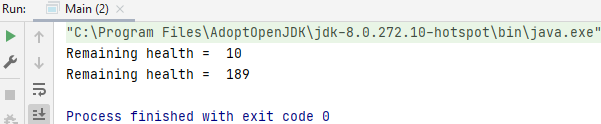
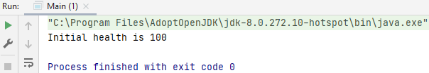

## Encapsulation

Encapsulation is related to the access modifiers private, public, protected.

With encapsulation, the variables of a class are hidden from other classes and are accessible only through the methods of their current class.

Therefore, it is also called <i>data hiding</i>.

To achieve encapsulation in Java:
- Declare the variables (properties) of a class as private.
- Develop public get&set methods to modify and view the variable values.

### Encapsulation1

Encapsulation is the mechanism that allows you to restrict access to certain components in the objects that you are creating you're able to protect the members of a class from external access in order to guard against unauthorized access.

We're gonna start off with the class that doesn't use it: `player.java` and then we're going to create an enhanced class that does use it: `enhancedplayer.java`.

#### Step 1: creating variables - Player.java

We are using public instead of private.

    public String name;
    public int health;
    public String weapon;

#### Step 2: not using a constructor - Player.java

#### Step 3: method loseHealth - Player.java

Reduce number of lives remaining for the player.

    public void loseHealth(int damage) {
        this.health = this.health - damage;
        if(this.health <=0) {
            System.out.println("Player knocked out");
        }
    }

#### Step 4: method healthRemaining - Player.java

    public int healthRemaining() {
        return this.health;
    }

#### Step 5: create an instance - Main.java

    Player player = new Player();

We haven't created the constructor, and because we haven't created a constructor, a default constructor with no parameters has been created for you. So we now need to manually set those fields, set the values for those fields.

        player.name = "Tim";
        player.health = 20;
        player.weapon = "Sword";

        int damage = 10;
        player.loseHealth(damage);
        System.out.println("Remaining health =  " + player.healthRemaining());

        damage = 11;
        player.health = 200; 

Problem: with this we're taking the control out of the player class by being able to access those fields directly you're opening up your application to be accessed in ways that you didn't want it to do.

        player.loseHealth(damage);
        System.out.println("Remaining health =  " + player.healthRemaining());

### Encapsulation2

#### Step 6: creating variables - EnhancedPlayer.java

We are using private instead of public.

    private String name;
    private int hitPoints = 100; // this was health, changed to hitpoints
    private String weapon;

#### Step 7: creating a constructor - EnhancedPlayer.java

Making a validation for health.

    public EnhancedPlayer(String name, int health, String weapon) {
        this.name = name;

        if(health >0 && health <= 100) {
            this.hitPoints = health;
        }

        this.weapon = weapon;
    }

#### Step 8: method loseHealth - EnhancedPlayer.java

Reduce number of lives remaining for the player.

    public void loseHealth(int damage) {
        this.hitPoints = this.hitPoints - damage;
        if(this.hitPoints <=0) {
            System.out.println("Player knocked out");
        }
    }

#### Step 9: getter - EnhancedPlayer.java

    public int getHealth() {
        return hitPoints;
    }

We've got some validation, which we weren't able to do if we weren't using encapsulation.
This is encapsulation, by making our fields private, we're making sure that our class is not accessible, or the fields within the class aren't accessible to any classes that are outside

This is another cool feature encapsulation, we can make all these changes to this enhanced player class, we can create private fields and private functions that we don't want to be exposed to any other class, and we can change those names at any time in this code without affecting any other code that's really one of the huge benefits of encapsulation, is that you're not actually affecting any other code.

#### Step 10: create an instance - Main.java

    package O_Encapsulation.Encapsulation2;

    public class Main {
    
        public static void main(String[] args) {
            EnhancedPlayer player = new EnhancedPlayer("Tim", 200, "Sword");
            System.out.println("Initial health is " + player.getHealth());
        }
    }

