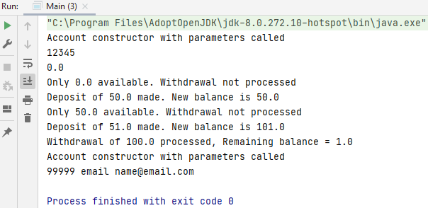

## Constructor

A constructor in Java is a special method that is used to initialize objects. The constructor is called when an object of a class is created. It can be used to set initial values for object attributes.

## Example

### Step 1: creating variables - Account.java

    private String number;
    private double balance;
    private String customerName;
    private String customerEmailAddress;
    private String customerPhoneNumber;

### Step 2: getters and setters - Account.java

    public String getNumber() {
    return number;
    }

    public void setNumber(String number) {
        this.number = number;
    }

    public double getBalance() {
        return balance;
    }

    public void setBalance(double balance) {
        this.balance = balance;
    }

    public String getCustomerName() {
        return customerName;
    }

    public void setCustomerName(String customerName) {
        this.customerName = customerName;
    }

    public String getCustomerEmailAddress() {
        return customerEmailAddress;
    }

    public void setCustomerEmailAddress(String customerEmailAddress) {
        this.customerEmailAddress = customerEmailAddress;
    }

    public String getCustomerPhoneNumber() {
        return customerPhoneNumber;
    }

    public void setCustomerPhoneNumber(String customerPhoneNumber) {
        this.customerPhoneNumber = customerPhoneNumber;
    }

### Step 3: method deposit - Account.java

Use this to make sure that this is the field that we're updating.

`balance = depositAmount` is going to replace the amount, so use `balance += depositAmount` is add to the balance by using the plus equal operator.

    public void deposit(double depositAmount) {
        this.balance += depositAmount;
        System.out.println("Deposit of " + depositAmount + " made. New balance is " + this.balance);
    }

### Step 4: method withdrawal - Account.java

Use if to test to see whether there was sufficient funds available to process the withdrawal.

    public void withdrawal(double withdrawalAmount) {
        if (this.balance - withdrawalAmount < 0) {
            System.out.println("Only " + this.balance + " available. Withdrawal not processed");
        } else {
            this.balance -= withdrawalAmount;
            System.out.println("Withdrawal of " + withdrawalAmount + " processed, Remaining balance = " + this.balance);
        }
    }

### Step 5: Main.java 

    Account bobsAccount = new Account();

### Step 6: testing if it works - Main.java

    bobsAccount.withdrawal(100.0);
    
    bobsAccount.deposit(50.0);
    bobsAccount.withdrawal(100.0);
    
    bobsAccount.deposit(51.0);
    bobsAccount.withdrawal(100.0);

### Step 7: Main.java

Cost a lot of time typing this out, so use a constructor in the account class.

The constructor is created for you automatically by Java when you type 'new Account()': this is calling the constructor

    bobsAccount.setNumber("12345");
    bobsAccount.setBalance(0.00);
    bobsAccount.setCustomerName("Bob Brown");
    bobsAccount.setCustomerEmailAddress("my@email.com");
    bobsAccount.setCustomerPhoneNumber("080-1234567");

### Step 8: constructor to put in the info from step 7 - Account.java

`public Account()`: you don't need void with a constructor, only public

`public Account()`: type in the name of the class for your constructor `Account()`

    public Account(String number, double balance, String customerName, String customerEmailAddress, String customerPhoneNumber) {
        System.out.println("Account constructor with parameters called");

### Step 9: setting the field values in the constructor - Account.java

    this.number = number;
    this.balance = balance;
    this.customerName = customerName;
    this.customerEmailAddress = customerEmailAddress;
    this.customerPhoneNumber = customerPhoneNumber;

### Step 10: use parameters from the constructor - Main.java

    Account bobsAccount = new Account("12345", 0.00, "Bob Brown", "myemail@bob.com", "(087) 123-4567");

### Step 11: print out the parameters from step 10 - Main.java

    System.out.println(bobsAccount.getNumber());
    System.out.println(bobsAccount.getBalance());

### Step 12: make another constructor - Account.java

Make sure you update the variables you don't use, so number and balance.

    public Account(String customerName, String customerEmailAddress, String customerPhoneNumber) {
        this("99999", 200, customerName, customerEmailAddress, customerPhoneNumber);
    }

### Step 13: call the constructor and print - Main.java

    Account danisAccount = new Account("Danielle", "name@email.com", "12345");
        System.out.println(danisAccount.getNumber() + " email " + danisAccount.getCustomerEmailAddress());

99999 email name@email.com: 99999 komt van account.java en e-mail van main.java.

