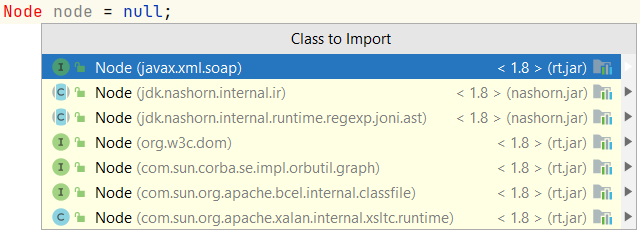

**Packages**

    Node node = null;

Two ways to add a class:
1. clicking on the 'Class to import' and the package will be added automatically 
2. fill it in in front of 'Node' (not imported) for example   

        javax.xml.soap.Node node = null;

When are you doing option 2? When you have two different Node packages and Java give's an 
error to choise wich one to use: you are allowed to have 1 import package and use option 2

