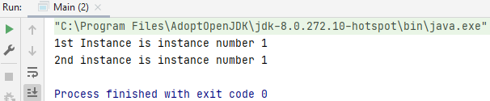
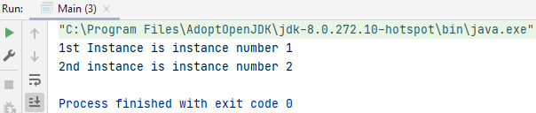
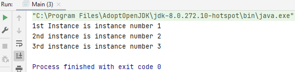
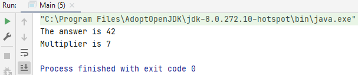

## Static

In the Java programming language, the keyword static is used to share the same variable or method of a given class. This means that only one instance of that static member (variable or method) is created that is shared by all instances of the class.

Non-static (i.e., without the keyword static) means that there is a unique variable or method per object.

You use static to be more memory efficient. Example is the static main method.

Limit (as a beginning programmer) the use of static!

### Example StaticStatement

#### Step 1: Create new class StaticTest.java.

#### Step 2: Variables StaticTest.java

    private int numInstances = 0;
    private String name;

#### Step 3: Constructor StaticTest.java

    public StaticTest(String name) {
        this.name = name;
        numInstances++;
    }

#### Step 4: Getters StaticTest.java

    public int getNumInstances() {
        return numInstances;
    }

    public String getName() {
        return name;
    }

#### Full code StaticTest.java.

    package Q_Static.Example.StaticStatement;
    
    public class StaticTest {
    private int numInstances = 0;
    private String name;
    
        public StaticTest(String name) {
            this.name = name;
            numInstances++;
        }
    
        public int getNumInstances() {
            return numInstances;
        }
    
        public String getName() {
            return name;
        }
    }

#### Step 5: Create instances Main.java

    package Q_Static.Example.StaticStatement;
    
    public class Main {   
        public static void main(String[] args) {
            StaticTest firstInstance = new StaticTest("1st Instance");
            System.out.println(firstInstance.getName() + " is instance number " + firstInstance.getNumInstances());
            StaticTest secondInstance = new StaticTest("2nd instance");
            System.out.println(secondInstance.getName() + " is instance number " + secondInstance.getNumInstances());
        }
    }

We started with numbers is equal zero but a static field which is also known as a class variable is associated with the class rather than with any particular instance of it, so it's only ever one copy of the variable in memory. All instances of the class share that one class variable.

### Example StaticStatement2

### Step 6: change into static StaticTest.java

Change `private int numInstances = 0;` into `private static int numInstances = 0;`.

    package Q_Static.Example.StaticStatement2;
    
    public class StaticTest {
        private static int numInstances = 0;
        private String name;
    
        public StaticTest(String name) {
            this.name = name;
            numInstances++;
        }
    
        public int getNumInstances() {
            return numInstances;
        }
    
        public String getName() {
            return name;
        }
    }

#### Step 7: run Main.java 

    StaticTest firstInstance = new StaticTest("1st Instance");
    System.out.println(firstInstance.getName() + " is instance number " + firstInstance.getNumInstances());
    StaticTest secondInstance = new StaticTest("2nd instance");
    System.out.println(secondInstance.getName() + " is instance number " + secondInstance.getNumInstances());

#### Step 8: create third instance Main.java 

    StaticTest thirdInstance = new StaticTest("3rd instance");
    System.out.println(thirdInstance.getName() + " is instance number " + secondInstance.getNumInstances());

#### Step 9: thirdInstance has 'secondInstance' and it works Main.java

The reason it returned it is because they're all sharing the same copy of instances, so it doesn't matter. Which instance of the class we use to access a static field, it's always going to return that what is then the valid number.

### Example StaticStatement3

#### Step 10: Change 'public int' into 'public static int' StaticTest.java

    package Q_Static.Example.StaticStatement3;
    
    public class StaticTest {
        private static int numInstances = 0;
        private String name;
    
        public StaticTest(String name) {
            this.name = name;
            numInstances++;
        }

        public static int getNumInstances() {
            return numInstances;
        }
    
        public String getName() {
            return name;
        }
    }

#### Step 11: change 'firstInstance.getNumInstances' into 'StaticTest.getNumInstances' Main.java

    package Q_Static.Example.StaticStatement3;
    
    public class Main {
    
        public static void main(String[] args) {
            StaticTest firstInstance = new StaticTest("1st Instance");
            System.out.println(firstInstance.getName() + " is instance number " + StaticTest.getNumInstances());
            StaticTest secondInstance = new StaticTest("2nd instance");
            System.out.println(secondInstance.getName() + " is instance number " + StaticTest.getNumInstances());
    
            StaticTest thirdInstance = new StaticTest("3rd instance");
            System.out.println(thirdInstance.getName() + " is instance number " + StaticTest.getNumInstances());
        }
    }

It makes it clear now, because you're saying that it's the class name, and it's not using the instance name, firstInstance. This is a static method.

Static methods and fields belong to the class, not to instances of the class, and as a result, can be called by referencing the class name, as you see here, rather than a class instance. This explains why the main method we've used throughout the course has to be static.

### Example Static

Now that we understand static methods and fields, and these are sometimes referred to as class methods and class variables, we can work out why all the methods we've created in main have also been static.

#### Step 01: Main.java

    public int multiplier = 7;

#### Step 02: Method multiply Main.java

The public method multiply takes a number and returns the result of multiplying it with the public multiplier field that we defined on line 10.

    public int multiply(int number) {
        return number * multiplier;
    }

#### Step 03: Call the method Main.java

Gives an error: 'Non-static method multiply int can't be referenced from a static context.'

So if multiply is public, then why can't we access it from our main method?

Normal class fields require an instance of the class that don't actually exist until an instance has been created. The main method is static as we can see. And it can be called with the class instance. As a result, Java can't allow a static method to access non-static fields or methods because frankly they don't exist when the static Methods called.

    public static void main(String[] args) {
        int answer = multiply(6);
        System.out.println("The answer is " + answer);
        System.out.println("Multiplier is " + multiplier);
    }

#### Step 04: Change into static Main.java

    public static int multiplier = 7;

#### Step 05: Change into static

    public static int multiply(int number) {
        return number * multiplier;
    }

