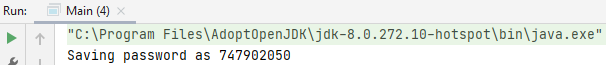

## Final Statement

In Java, when final keyword is used with a variable of primitive data types (int, float, .. etc), value of the variable cannot be changed.

For example following program gives error because i is final.

    public class Test {
        public static void main(String args[]) {
            final int i = 10;
            i = 30; // Error because i is final.
        }
    }

When final is used with non-primitive variables (Note that non-primitive variables are always references to objects in Java), the members of the referred object can be changed. final for non-primitive variables just mean that they cannot be changed to refer to any other object.

    class Test1 {
    int i = 10;
    }
    
    public class Test2 {
        public static void main(String args[]) {
            final Test1 t1 = new Test1();
            t1.i = 30;  // Works
        }
    }

### Example

Final statement: you use that generally to define constant values but also if you want to prevent that a class can be extended, that a method can be overridden or that the value of a variable is overwritten, you use the keyword final. So you can use final on class, method and variable level. It's very useful to selectively make some methods final in your classes if you know they're going to be overwritten or  there's a chance they're going to be overwritten.

#### Step 1: variables - SomeClass.java

    private static int classCounter = 0;
    public final int instanceNumber;
    private final String name;

#### Step 2: constructor - SomeClass.java

    public SomeClass(String name) {
        this.name = name;
        classCounter++;
        instanceNumber = classCounter;
        System.out.println(name + " created, instance is " + instanceNumber);
    }

#### Step 3: getter - SomeClass.java

    public int getInstanceNumber() {
        return instanceNumber;
    }

#### Step 4: creating instances - Main.java

Unlike with static where we had a getter for the static field and we always got the same value, here we're storing the incremented static value in a class field so each instance of a class will maintain its own value.

    SomeClass one = new SomeClass("one");
    SomeClass two = new SomeClass("two");
    SomeClass three = new SomeClass("three");

#### Step 5: getInstanceNumber Main.java

Notice how they're all maintaining their own value for instance number.

    System.out.println(one.getInstanceNumber());
    System.out.println(two.getInstanceNumber());
    System.out.println(three.getInstanceNumber());

#### Step 6: check instanceNumber Main.java

By making instance number final, its value can't be changed once the class instance has been created attempting to do so will give an error, and the code won't even compile

    one.instanceNumber = 4;

Gives error: Cannot assign a value to final variable instanceNumber

It's actually a good idea to mark variables as final whenever you know that the value shouldn't be changed once the initial value's been set. A constant value would be an ideal candidate for that (didn't use it in this example).

#### Step 7: Password.java

This is an example of why you'd want to prevent one of your methods from being overwritten.

#### Step 8: variables - Password.java

    private static final int key = 748576362; 
    private final int encryptedPassword;

#### Step 9: constructor - Password.java

We'll pass the password in the constructor. We'll also have an encrypt function, so the password would come in just as a password and encrypted and move our function to encrypt the password. So I'm writing a function that will encrypt or decrypt and then save it into the encrypted password, which is encrypted at that point.

    public Password(int password) {
        this.encryptedPassword = encryptDecrypt(password);
    }

#### Step 10: parameter - Password.java

Setting a parameter of the password, which return password.

    private int encryptDecrypt(int password) {
        return password ^ key;
    }

#### Step 11: store the passwords - Password.java

    public void storePassword() {
        System.out.println("Saving password as " + this.encryptedPassword);
    }

#### Step 12: method - Password.java

Check if the password is valid.

    public boolean letMeIn(int password) {
        if (encryptDecrypt(password) == this.encryptedPassword) {
            System.out.println("Welcome");
            return true;
        } else {
            System.out.println("Nope, you cannot come in");
            return false;
        }
    }

#### Step 13: create instance - Main.java

Create a new password instance, called storePassword.

    int pw = 674312;
    Password password = new Password(pw);
    password.storePassword();

This is a complete different number then 674312. The constructor takes the password and encrypts it.

#### Step 14: method letMeIn - Main.java

Call the `letMeIn` method, with a few passwords to check to see if it is working.

    password.letMeIn(6); // Nope, you cannot come in
    password.letMeIn(-5497); // Nope, you cannot come in
    password.letMeIn(721946); // Nope, you cannot come in
    password.letMeIn(674312); // Welcome

#### Step 15: ExtendedPassword.java

What would prevent us for someone from extending the Password class and then changing the Method itself.

#### Step 16: variables - ExtendedPassword.java

    private int decryptedPassword;

#### Step 17: constructor - ExtendedPassword.java

    public ExtendedPassword(int password) {
        super(password);
        this.decryptedPassword = password;
    }

#### Step 18: override method - ExtendedPassword.java

    @Override
        public void storePassword() {
        System.out.println("Saving password as " + this.decryptedPassword);
    }

#### Step 19: instance - Main.java

Create a new extended password instance, called storePassword.

    int pw2 = 674312;
    Password passwordex = new ExtendedPassword(pw);
    passwordex.storePassword();

prints out: Saving password as 674312

You can see how this is completely changed the security of the original password class.

#### Step 20: change into final - Password.java

Change `storePassword` into final: it cannot override store password because method is final.

    public final void storePassword() {
        System.out.println("Saving password as " + this.encryptedPassword);
    }