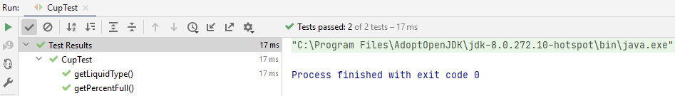

## JUnit5 Example

### Creating a class

We are going to test the following class.

    public class Cup {
    private String liquidType;
    private double percentFull;
    
        public Cup(String liquidType, double percentFull) {
            this.liquidType = liquidType;
            this.percentFull = percentFull;
        }
    
        public String getLiquidType() {
            return liquidType;
        }
    
        public void setLiquidType(String liquidType) {
            this.liquidType = liquidType;
        }
    
        public double getPercentFull() {
            return percentFull;
        }
    
        public void setPercentFull(double percentFull) {
            this.percentFull = percentFull;
        }
    }

### Test class aanmaken

Right click on `Cup` and click on `Show Context Actions`.

Then click `Test`, then `Ok` and the following screen will appear.

It says the library is not found, so click `Fix` and click `Ok` again.

You can now choose which methods you want to test, click the one you want to test and click `Ok`.

A test file has been created: `CupTest.java`. It indicates that it has a problem, so add the library it is asking for.

    import org.junit.jupiter.api.Test;

    import static org.junit.jupiter.api.Assertions.*;
    
    class CupTest {
    
        @Test
        void getLiquidType() {
        }
    }

### Creating a test

We first create an object.

    @Test
    void getLiquidType() {
        Cup c = new Cup("Orange Juice", 85);
    }

Then we are going to use `assertEquals`, specify the expected value of orange juice and then specify where we get it from so from `c.getLiquidType()`.

    @Test
    void getLiquidType() {
        Cup c = new Cup("Orange Juice", 85);
        assertEquals("Orange Juice", c.getLiquidType());
    }

Run `CupTest.java` and you will see that the test passed.

### Another test

    import org.junit.jupiter.api.Test;

    import static org.junit.jupiter.api.Assertions.*;
    
    class CupTest {
    
        @Test
        void getLiquidType() {
            Cup c = new Cup("Orange Juice", 85);
            assertEquals("Orange Juice", c.getLiquidType());
        }
    
        @Test
        void getPercentFull() {
            Cup c = new Cup("Orange Juice", 85);
            assertEquals(85, c.getPercentFull(), 0.001);
        }
    }

When working with `double` it is best when you add a third parameter, `delta`. This one ensures that you are as accurate to the number as possible.

### Check test

Make sure that your test are running and it's correctly running things.

Create another test in `getLiquidType` with expected 42 and actual 24. We know this is incorrect and we want to see that the testing goes well.

    assertEquals(42, 24);

