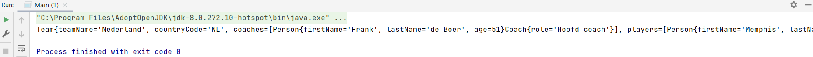

## Euro Console App Part 2

Deze app is bedoeld om gegevens van het team in op te slaan en te hergebruiken.

### Stap 20: ArrayList AppController.java

Nieuwe ArrayList aangemaakt voor teams.

    private ArrayList<Team> teams = new ArrayList<>();

### Stap 21: Team.java 

Twee Strings, `teamName` en `countryCode` aangemaakt. Constructor, getter en setter aangemaakt.

    package Z_EuroConsoleApp;
    
    public class Team {
    private String teamName;
    private String countryCode;
    
        public Team(String teamName, String countryCode) {
            this.teamName = teamName;
            this.countryCode = countryCode;
        }
    
        public String getTeamName() {
            return teamName;
        }
    
        public void setTeamName(String teamName) {
            this.teamName = teamName;
        }
    
        public String getCountryCode() {
            return countryCode;
        }
    
        public void setCountryCode(String countryCode) {
            this.countryCode = countryCode;
        }
    }

### Stap 22: ArrayList Team.java

Binnen Team.java zijn twee lijsten: `coaches` en `players`.

    private ArrayList<Coach> coaches = new ArrayList<>();
    private ArrayList<Player> players = new ArrayList<>();

### Stap 23: methodes Team.java

We schrijven twee `add` methodes. Het enige wat zij doen is een coach toevoegen aan een lijst van coaches en die andere een player toevoegen aan een lijst van players.

    public void addCoach(Coach newCoach) {
        coaches.add(newCoach);
    }

    public void addPlayer(Player newPlayer) {
        players.add(newPlayer);
    }

### Stap 24: toString Team.java

    @Override
    public String toString() {
        return "Team{" +
                "teamName='" + teamName + '\'' +
                ", countryCode='" + countryCode + '\'' +
                ", coaches=" + coaches +
                ", players=" + players +
                '}';
    }

### Stap 25: methode generateHollandTeam AppController.java

Maak een nieuw object aan.

    Team holland = new Team("Nederland", "NL");

Voeg de gegevens van spelers en coach toe.

    Player player1 = new Player("Memphis", "Depay", 27, 9);
    Player player2 = new Player("Donny", "van de Beek", 24, 20);
    
    Coach coach1 = new Coach("Frank", "de Boer", 51);
    coach1.setRole("Hoofd coach");

De spelers voeg je toe aan de lijst `addPlayer` en `addCoach`.

    holland.addPlayer(player1);
    holland.addPlayer(player2);
    
    holland.addCoach(coach1);

Als laatste voeg je team holland toe aan de lijst van teams binnen de AppController.

    teams.add(holland);

De volledige code van `generateHollandTeam` is als volgt.

    public void generateHollandTeam(){
        Team holland = new Team("Nederland", "NL");

        Player player1 = new Player("Memphis", "Depay", 27, 9);
        Player player2 = new Player("Donny", "van de Beek", 24, 20);

        Coach coach1 = new Coach("Frank", "de Boer", 51);
        coach1.setRole("Hoofd coach");

        holland.addPlayer(player1);
        holland.addPlayer(player2);

        holland.addCoach(coach1);
        
        teams.add(holland);
    }

### Stap 26: methode printTeams

Methode die alle teams gaat uitprinten.

We maken een tijdelijke variabele binnen de for-loop aan, die elke keer eentje van de lijst afhaalt en die tijdelijk kopieert en die je dan aanroept in de print: `Team tmpTeam = teams.get(i);`.

    public void printTeams() {
        for (int i = 0; i < teams.size(); i++) {
            Team tmpTeam = teams.get(i);
            System.out.println(tmpTeam);
        }
    }

### Stap 27: constructor 

Het aanroepen van `generateHollandTeam` en `printTeams` doe je in de constructor van AppController.java.

    public AppController() {
        this.generateHollandTeam();
        this.printTeams();
    }

### Volledige code AppController.java

    package Z_EuroConsoleApp;
    
    import java.util.ArrayList;
    
    public class AppController {
    private ArrayList<Person> persons = new ArrayList<Person>();
    private ArrayList<Team> teams = new ArrayList<>();
    
        public AppController() {
            this.generateHollandTeam();
            this.printTeams();
        }
    
        public void generateHollandTeam(){
            Team holland = new Team("Nederland", "NL");
    
            Player player1 = new Player("Memphis", "Depay", 27, 9);
            Player player2 = new Player("Donny", "van de Beek", 24, 20);
    
            Coach coach1 = new Coach("Frank", "de Boer", 51);
            coach1.setRole("Hoofd coach");
    
            holland.addPlayer(player1);
            holland.addPlayer(player2);
    
            holland.addCoach(coach1);
    
            teams.add(holland);
        }
    
        public void printTeams() {
            for (int i = 0; i < teams.size(); i++) {
                Team tmpTeam = teams.get(i);
                System.out.println(tmpTeam);
            }
        }
    
        public void generatePerson() {
            Person person1 = new Person("Danielle", "van den Akker", 37);
            Person person2 = new Person("Freckle", "van den Akker", 2);
            Person person3 = new Person("Frummel", "van den Akker", 1);
    
            persons.add(person1);
            persons.add(person2);
            persons.add(person3);
        }
    
        public void generatePlayers() {
            Player player1 = new Player("Memphis", "Depay", 27, 9);
            Player player2 = new Player("Donny", "van de Beek", 24, 20);
    
            persons.add(player1);
            persons.add(player2);
        }
    
        public void generateCoach() {
            Coach coach1 = new Coach("Frank", "de Boer", 51);
            coach1.setRole("Hoofd coach");
    
            persons.add(coach1);
        }
    
        public void printList() {
            int listSize = persons.size();
    
            for (int i = 0; i < listSize; i++) {
                Person tmpPerson = persons.get(i);
                System.out.println(tmpPerson);
            }
        }
    }

### Stap 28: run Main.java

    package Z_EuroConsoleApp;

    public class Main {
        public static void main(String args[]) {
            AppController app = new AppController();
        }
    }

`Team{teamName='Nederland', countryCode='NL', coaches=[Person{firstName='Frank', lastName='de Boer', age=51}Coach{role='Hoofd coach'}], players=[Person{firstName='Memphis', lastName='Depay', age=27}Player{position=9}, Person{firstName='Donny', lastName='van de Beek', age=24}Player{position=20}]}`

Dit team object `holland` bevat alle informatie van meerdere type objecten.

### Stap 29 data methode wegschrijven naar een data bestand

We maken een nieuwe file aan: `FileHandler.java`.

De data ga je opslaan in teams.txt.

    private static String fileName = "teams.txt";

Wanneer we met bestanden werken en je vult `File` in dan zie je `java.io`. Deze package werkt met File.

We maken een object aan van type `File` genaamd `dataFile`. `fileName` geven we als variabele mee aan de constructor.

    public static void writeData(String data) {
        File dataFile = new File(fileName);
    }

Om het bestand te schrijven heb je de `FileWriter`. Deze is prima om toe te passen op kleine hoeveelheden data. `dataFile` geven we mee aan de constructor.

    public static void writeData(String data) {
        File dataFile = new File(fileName);
        FileWriter fw = new FileWriter(dataFile);
    }

Wanneer je met bestanden gaat werken krijg je te maken met `exceptions`. Je gaat alles tussen `try` en `catch` zetten. Wat `try` en `catch` doet, is het opvangen wanneer het verkeerd gaan.

    public static void writeData(String data) {
        try {
            File dataFile = new File(fileName);
            FileWriter fw = new FileWriter(dataFile);
        }
        catch(Exception ex) {
            System.out.println("Exception opgetreden tijdens het wegschrijven: " + ex.getMessage());
        }
    }

Voor het wegschrijven van data heb je een derde object nodig, namelijk `BufferedWriter`. `fw` geven we mee aan de constructor.

    public static void writeData(String data) {
        try {
            File dataFile = new File(fileName);
            FileWriter fw = new FileWriter(dataFile);
            BufferedWriter bw = new BufferedWriter(fw);
        }
        catch(Exception ex) {
            System.out.println("Exception opgetreden tijdens het wegschrijven: " + ex.getMessage());
        }
    }

Met `bw` kunnen we de `write` methode aanroepen en daar de `data` ingooien. Daarna een nieuwe line toevoegen met `newLine()` en als laatste sluiten me `close()`.

    public static void writeData(String data) {
        try {
            File dataFile = new File(fileName);
            FileWriter fw = new FileWriter(dataFile);
            BufferedWriter bw = new BufferedWriter(fw);
            bw.write(data);
            bw.newLine();
            bw.close();
        }
        catch(Exception ex) {
            System.out.println("Exception opgetreden tijdens het wegschrijven: " + ex.getMessage());
        }
    }

#### Volledige code FileHandler.java

    package Z_EuroConsoleApp;
    
    import java.io.BufferedWriter;
    import java.io.File;
    import java.io.FileWriter;
    
    public class FileHandler {
        private static String fileName = "teams.txt";
    
        public static void writeData(String data) {
            try {
                File dataFile = new File(fileName);
                FileWriter fw = new FileWriter(dataFile);
                BufferedWriter bw = new BufferedWriter(fw);
                bw.write(data);
                bw.newLine();
                bw.close();
            }
            catch(Exception ex) {
                System.out.println("Exception opgetreden tijdens het wegschrijven: " + ex.getMessage());
            }
        }
    }

### Stap 30: data wegschrijven aanroepen AppController.java

In AppController.java maak je het bestand aan. We zetten deze in de methode `generateHollandTeam`.

    FileHandler.writeData(holland.toString());

Wanneer je de Main.java runt dan komt er een nieuw bestand in je map te staan: `teams.txt`.

De data die we op het scherm kregen bij <i>stap 28</i> krijgen we nu in een bestand.

### Stap 31: controleren werking exception FileHandler.java

Stel je wilt het bestand opslaan op een plek dat niet bestaat: `E:\\tmp\\teams.txt`.

    private static String fileName = "E:\\tmp\\teams.txt";

Wanneer je Main.java nu runt krijg je de volgende melding in de console: 

> Exception opgetreden tijdens het wegschrijven: E:\tmp\teams.txt (Het systeem kan het opgegeven pad niet vinden)

Dit wordt opgevangen door de `catch` in FileHandler.java.

### Stap 32: overschrijven teams.text

Elke keer wanneer je Main.java runt, overschrijft hij de file `teams.txt`. Wanneer je dit niet wilt, doe je het volgende in FileHandler.java.

Aan FileWriter voeg je de `append: true` toe.

    FileWriter fw = new FileWriter(dataFile, true);

Run Main.java en er wordt een regel toegevoegd in plaats van vervangen.

### Stap 33: geen static methode gebruiken FileHandler.java

Wanneer je de file van FileHandler.java wilt aanroepen zonder dat er met static wordt gewerkt doe je het volgende in AppController.java in de methode `generateHollandTeam`.

    FileHandler fh = new FileHandler();
    fh.writeData(holland.toString());

In plaats van: `FileHandler.writeData(holland.toString());`.

Tip: gebruik static zo min mogelijk!