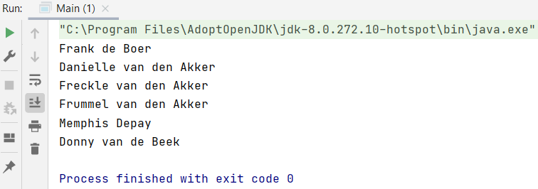
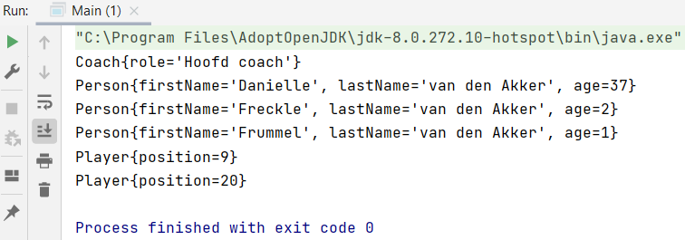
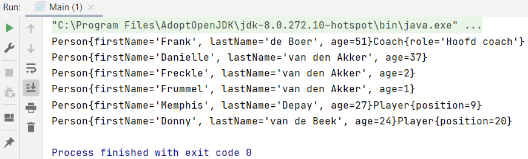

## Euro Console App

Deze app is bedoeld om gegevens van het team in op te slaan en te hergebruiken.

### Stap 1: Person.java 

In deze Person klasse houden we informatie bij over een persoon.

    package Z_EuroConsoleApp;
    
    public class Person {
        private String firstName;
        private String lastName;
        private int age;
    }

We maken de klasse variabelen die bovenaan staan altijd `private` omdat we niet willen dat andere klasse deze kunnen benaderen. Het benaderen van deze informatie kun je het beste doen via de `get` en `set` methode.

### Stap 2: getters en setters Person.java

Een `getter` geeft een waarde terug. Een `setter` neemt de String over en kopieert hem naar de interne variabele.

    public String getFirstName() {
        return firstName;
    }

    public void setFirstName(String firstName) {
        this.firstName = firstName;
    }

    public String getLastName() {
        return lastName;
    }

    public void setLastName(String lastName) {
        this.lastName = lastName;
    }

    public int getAge() {
        return age;
    }

    public void setAge(int age) {
        this.age = age;
    }

### Stap 3: constructor Person.java

Een `constructor` is een methode die automatisch wordt aangemaakt bij het aanmaken van een object.

    public Person(String firstName, String lastName, int age) {
        this.firstName = firstName;
        this.lastName = lastName;
        this.age = age;
    }

Een constructor herken je, omdat hij geen return type heeft tussen de naam van de methode en de access modifier. De naam van de constructor is altijd hetzelfde als die van de klasse naam.

### Stap 4: Main.java en AppController.java

We kunnen de Person.java klasse gebruiken in AppController.java. Waarom in AppController.java en niet in Main.java? We willen de Main.java zo leeg mogelijk houden. De volgende regel staat in Main.java.

    package Z_EuroConsoleApp;
    
    public class Main {
        public static void main(String args[]) {
            AppController app = new AppController();
        }
    }

### Stap 5: constructor AppController.java

Een constructor moet altijd public zijn, deze kan namelijk worden aangeroepen vanuit een andere klasse.

    package Z_EuroConsoleApp;
    
        public class AppController {
            public AppController() {
        }
    }

### Stap 6: methode generatePerson AppController.java

We maken een persoon object aan binnen AppController en vullen de waardes in die je in de constructor van Person.java ziet: firstName, lastName en age.

    public void generatePerson(){
        Person person1 = new Person("Danielle", "van den Akker", 37);
    }

Je kunt hier zoveel personen invullen als je zelf wilt.

    public void generatePerson(){
        Person person1 = new Person("Danielle", "van den Akker", 37);
        Person person2 = new Person("Freckle", "van den Akker", 2);
        Person person3 = new Person("Frummel", "van den Akker", 1);
    }

We hebben nu 3 objecten aangemaakt, person1, person2 en person3.

### Stap 7: overerven Player.java

In de Player.java klasse wil je ook de firstName, lastName en age bijhouden. Het is dan handig dat je gaat overerven van Person, dit doe je met `extends`. Daarnaast voeg je een `constructor` toe. 

Wanneer je een subklasse hebt dan moet je ook de constructor van de superklasse invullen. `super` verwijst naar de constructor van Person.java.

    package Z_EuroConsoleApp;
    
    public class Player extends  Person {
        public Player(String firstName, String lastName, int age) {
            super(firstName, lastName, age);
        }
    }

### Stap 8: overerven Coach.java

    package Z_EuroConsoleApp;
    
    public class Coach extends Person{
        public Coach(String firstName, String lastName, int age) {
            super(firstName, lastName, age);
        }
    }

### Stap 9: spelers genereren in AppController.java

We maken een player object aan binnen AppController en vullen de waardes in die je in de geovererfde constructor van Person.java in Player.java ziet: firstName, lastName en age.

    public void generatePlayers(){
        Player player1 = new Player("Memphis", "Depay", 27);
        Player player2 = new Player("Donny", "van de Beek", 24);
    }

### Stap 10: exta waardes/informatie in Player.java

Je wilt het shirt nummer van de speler toevoegen, maar dit geldt alleen voor Player.java.

Je maakt eerst een lege private int aan.

    private int position = 0;

Vervolgens maken we de getter en setter.

    public int getPosition() {
        return position;
    }

    public void setPosition(int position) {
        this.position = position;
    }

In de constructor voeg je de position toe.

    public Player(String firstName, String lastName, int age, int position) {
        super(firstName, lastName, age);
        this.position = position;
    }

### Stap 11: position invullen AppController.java

Gegevens shirt nummer invullen voor player1 en player2 in AppController.java.

    public void generatePlayers(){
        Player player1 = new Player("Memphis", "Depay", 27, 9);
        Player player2 = new Player("Donny", "van de Beek", 24, 20);
    }

### Stap 12: exta waardes/informatie in Coach.java

Stel je hebt verschillende rollen binnen Coach.java. Je maakt eerst een String role aan en dan getter en setter.

    package Z_EuroConsoleApp;
    
    public class Coach extends Person{
        private String role = "";
    
        public Coach(String firstName, String lastName, int age) {
            super(firstName, lastName, age);
        }
    
        public String getRole() {
            return role;
        }
    
        public void setRole(String role) {
            this.role = role;
        }
    }

### Stap 13 methode AppController.java

Je maakt een nieuwe methode aan, maakt een nieuw object aan en voegt met `coach1.setRole("Hoofd coach");` de rol toe aan coach1.

    public void generateCoach(){
        Coach coach1 = new Coach("Frank", "de Boer", 51);
        coach1.setRole("Hoofd coach");
    }

### Stap 14 lijst toevoegen met ArrayList AppController.java

We hebben in AppController.java objecten aangemaakt, maar we doen er niets mee. We gaan een ArrayList toevoegen aan AppController.java genaamd persons.

    private ArrayList<Person> persons = new ArrayList<Person>();

Deze ArrayList geeft op dit moment een lege lijst.

### Stap 15 toevoegen aan ArrayList

Voordeel van de ArrayList persons is dat we person, player en coach kunnen toevoegen met `.add`: 
`persons.add(person1);`
`persons.add(person2);`
`persons.add(person3);`
`persons.add(player1);`
`persons.add(player2);`
`persons.add(coach1);`

    public void generatePerson(){
        Person person1 = new Person("Danielle", "van den Akker", 37);
        Person person2 = new Person("Freckle", "van den Akker", 2);
        Person person3 = new Person("Frummel", "van den Akker", 1);

        persons.add(person1);
        persons.add(person2);
        persons.add(person2);
    }

    public void generatePlayers(){
        Player player1 = new Player("Memphis", "Depay", 27, 9);
        Player player2 = new Player("Donny", "van de Beek", 24, 20);
        
        persons.add(player1);
        persons.add(player2);
    }

    public void generateCoach(){
        Coach coach1 = new Coach("Frank", "de Boer", 51);
        coach1.setRole("Hoofd coach");
        
        persons.add(coach1);
    }

### Stap 16 publieke methode printList maken

De printList methode gaat door de lijst heen loopen en laat alle objecten binnen de lijst zien.

We maken een tijdelijke variabele listSize aan die de size van de lijst opvraagt: `int listSize = persons.size();`. Deze is temporary variabele is tijdelijk en bestaat alleen in de for-loop.

Met een for loop gaan we door de lijst heen loopen.

We maken een tijdelijke variabele binnen de for-loop aan, die elke keer eentje van de lijst afhaalt en die tijdelijk kopieert en die je dan aanroept in de print: `Person tmpPerson = persons.get(i);`.

    public void printList() {
    int listSize = persons.size();

        for (int i = 0; i < listSize; i++) {
            Person tmpPerson = persons.get(i);
            System.out.println(tmpPerson.getFirstName() + " " + tmpPerson.getLastName());
        }
    }

### Stap 17 methodes in Main.java aanroepen

Je roept alle methodes van AppController aan. De volgorde van printen is dezelfde volgorde als wat je in Main.java hebt staan.

    package Z_EuroConsoleApp;
    
    public class Main {
        public static void main(String args[]) {
            AppController app = new AppController();
            app.generateCoach();
            app.generatePerson();
            app.generatePlayers();
            app.printList();
        }
    }

### Stap 18 toSTring

De toString methode zorgt ervoor dat de verschillende methodes worden uitgeprint.

<i>Player.java</i>

    @Override
    public String toString() {
        return "Player{" +
                "position=" + position +
                '}';
    }

<i>Coach.java</i>

    @Override
    public String toString() {
        return "Coach{" +
                "role='" + role + '\'' +
                '}';
    }

<i>Person.java</i>

    @Override
    public String toString() {
        return "Person{" +
                "firstName='" + firstName + '\'' +
                ", lastName='" + lastName + '\'' +
                ", age=" + age +
                '}';
    }

<i>AppController.java</i>

In plaats van `tmpPerson.getFirstName() + " " + tmpPerson.getLastName()` aan te roepen hoef je nu alleen `tmpPerson` neer te zetten.

    public void printList() {
        int listSize = persons.size();

        for (int i = 0; i < listSize; i++) {
            Person tmpPerson = persons.get(i);
            System.out.println(tmpPerson);
        }
    }

### Stap 19 super.toSTring()

Om de ontbrekende informatie van firstName, lastName en age toe te voegen and Coach en Player gebruik je super.toString().

<i>Coach.java</i>

    @Override
    public String toString() {
        return super.toString() + "Coach{" +
                "role='" + role + '\'' +
                '}';
    }

<i>Player</i>

    @Override
    public String toString() {
        return super.toString() + "Player{" +
                "position=" + position +
                '}';
    }

### Volledige code

<i>Person.java</i>

    package Z_EuroConsoleApp;
    
    public class Person {
    private String firstName;
    private String lastName;
    private int age;
    
        public Person(String firstName, String lastName, int age) {
            this.firstName = firstName;
            this.lastName = lastName;
            this.age = age;
        }
    
        public String getFirstName() {
            return firstName;
        }
    
        public void setFirstName(String firstName) {
            this.firstName = firstName;
        }
    
        public String getLastName() {
            return lastName;
        }
    
        public void setLastName(String lastName) {
            this.lastName = lastName;
        }
    
        public int getAge() {
            return age;
        }
    
        public void setAge(int age) {
            this.age = age;
        }
    
        @Override
        public String toString() {
            return "Person{" +
                    "firstName='" + firstName + '\'' +
                    ", lastName='" + lastName + '\'' +
                    ", age=" + age +
                    '}';
        }
    }

<i>Player.java</i>

    package Z_EuroConsoleApp;
    
    public class Player extends  Person {
    private int position = 0;
    
        public Player(String firstName, String lastName, int age, int position) {
            super(firstName, lastName, age);
            this.position = position;
        }
    
        public int getPosition() {
            return position;
        }
    
        public void setPosition(int position) {
            this.position = position;
        }
    
        @Override
        public String toString() {
            return super.toString() + "Player{" +
                    "position=" + position +
                    '}';
        }
    }

<i>Coach.java</i>

    package Z_EuroConsoleApp;
    
    public class Coach extends Person{
    private String role = "";
    
        public Coach(String firstName, String lastName, int age) {
            super(firstName, lastName, age);
        }
    
        public String getRole() {
            return role;
        }
    
        public void setRole(String role) {
            this.role = role;
        }
    
        @Override
        public String toString() {
            return super.toString() + "Coach{" +
                    "role='" + role + '\'' +
                    '}';
        }
    }

<i>AppController.java</i>

    package Z_EuroConsoleApp;
    
    import java.util.ArrayList;
    
    public class AppController {
    private ArrayList<Person> persons = new ArrayList<Person>();
    
        public AppController() {
        }
    
        public void generatePerson() {
            Person person1 = new Person("Danielle", "van den Akker", 37);
            Person person2 = new Person("Freckle", "van den Akker", 2);
            Person person3 = new Person("Frummel", "van den Akker", 1);
    
            persons.add(person1);
            persons.add(person2);
            persons.add(person3);
        }
    
        public void generatePlayers() {
            Player player1 = new Player("Memphis", "Depay", 27, 9);
            Player player2 = new Player("Donny", "van de Beek", 24, 20);
    
            persons.add(player1);
            persons.add(player2);
        }
    
        public void generateCoach() {
            Coach coach1 = new Coach("Frank", "de Boer", 51);
            coach1.setRole("Hoofd coach");
    
            persons.add(coach1);
        }
    
        public void printList() {
            int listSize = persons.size();
    
            for (int i = 0; i < listSize; i++) {
                Person tmpPerson = persons.get(i);
                System.out.println(tmpPerson);
            }
        }
    }

<i>Main.java</i>

    package Z_EuroConsoleApp;
    
    public class Main {
        public static void main(String args[]) {
            AppController app = new AppController();
            app.generateCoach();
            app.generatePerson();
            app.generatePlayers();
            app.printList();
        }
    }
